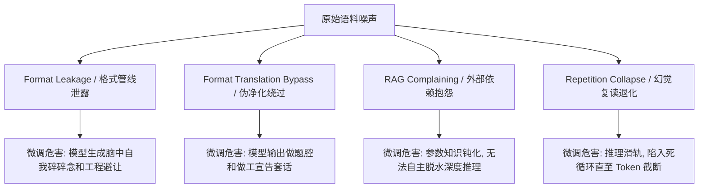
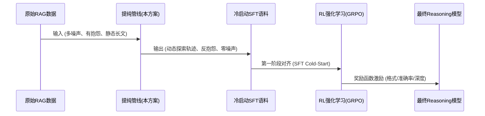

# 🩺 医疗问答 CoT（思维链）数据提纯工程规范与微调优化方案
> **Enterprise-Grade CoT Data Engineering Specification & Tuning Optimization Blueprint for Medical Reasoning Models**

---

## 🎯 一、 背景与痛点诊断

在以大模型（LLM）为基础的监督微调（SFT）和强化学习（RL，如 DeepSeek-R1）数据工程中，思维链（`<think>`）的纯净度与逻辑熵代表了最终模型的推理上限。通过对前期净化跑批数据的深度审计，我们发现了在 Reasoning 微调语料中普遍存在的**四大致命隐性痛点**。本规范旨在彻底阻断这些缺陷，建立工业级无噪声高熵 CoT 语料标准。

### 🚨 四大致命隐性缺陷



#### 1. 格式管线泄露 (Pipeline & Format Leakage)
*   **痛点表现**：思维链中混杂了大量工程 Pipeline 占位符、JSON 大括号、字段名（如 `sub_questions`、`evidences`）及 Markdown 代码块标记。
*   **微调危害**：导致模型在后续推理时，在脑中疯狂进行格式避让和字段对齐的碎碎念，破坏模型原生的思考连贯性。

#### 2. 伪净化绕过与做题腔 (Format Translation Bypass)
*   **痛点表现**：大模型在经历人类偏好对齐（RLHF）后天然具备“做题家心态”，重写时会走捷径——不改变原有流水线思路，仅仅是将 JSON 字段名翻译成白话文（如“*我的推理链条如下*”、“*核心证据来自文献*”）。
*   **微调危害**：训练后的模型会带有极强的“AI 客服腔”，无法直接进行学术级的因果推论。

#### 3. RAG 上下文抱怨与参数知识钝化 (RAG Context Complaining)
*   **痛点表现**：原始 CoT 中频繁出现“*根据现有资料显示...*”、“*由于现有证据未提供各成分具体药理，只能基于主治推测...*”等对检索参考上下文局限性的抱怨。
*   **微调危害**：在离线部署或脱离 RAG 检索时，模型会形成严重的“检索上下文依赖症”，自我钝化，不愿调用其体内庞大的千亿级**参数知识（Parametric Knowledge）**，退化为干瘪的上下文搬运工。

#### 4. 幻觉复读与死循环退化 (Repetition Loop & Degeneracy)
*   **痛点表现**：在长文本生成或温度较低时，模型因自注意力机制的“引力陷阱”，在思维链末尾发生整段文字的原封不动自我复读。
*   **微调危害**：微调后，模型在长推理时极易陷入**“思维链死循环（Looping Panic）”**，直到消耗完最大 Token 限制被截断，无法生成任何正常的答案正文。

---

## 🛠️ 二、 三位一体企业级提纯工程规范

针对上述痛点，本方案建立了**“探索式心流、反 RAG 抱怨、物理防复读”**三位一体的数据工程提纯规范。

### 📐 规范一：探索式 CoT 轨迹重构 (Exploratory CoT Trajectory)

> [!IMPORTANT]
> 优秀的 Reasoning 微调 CoT 绝不能是一篇平铺直叙、精简版教科书似的“静态科平时段落”。它必须呈现出**“探索式、推导式、逐步探究与排查”的动态思考轨迹（Thought Trace）**。

#### 1. 逻辑控制词与因果连词的强制约束
在重构思维链时，必须自然融合以下逻辑演进节点，模拟人类专家真实的内心独白（Inner Monologue）：
*   **起点解构**：*“首先，要明确该问题的核心临床矛盾在于...”*
*   **微观演绎**：*“这必然引导我们关注其分子层面的作用机制，即...”*
*   **逻辑折返/亚型排查**：*“慢着，这里存在一个关键分叉：为什么是亚型A而不是亚型B？因为...”*
*   **生理极限校验**：*“另外需要考虑，在特定生理状态（如无核细胞/肾功不全）下，这一抑制作用会持续...”*
*   **决策提炼合拢**：*“基于上述层层递进的病生理推导，我们最终能够锁定结论...”*

#### 2. 自我纠偏与支线排查的保留
保留高价值的逻辑思辨支线（如排查某种辅料是否构成绝对禁忌的过程），展示**【提出假设 -> 探究机制 -> 遇到逻辑分叉/交叉校验 -> 推导排除 -> 得出结论】**的动态全过程，最大化微调的“推理熵”。

---

### 🚨 规范二：反 RAG 边界抱怨与参数化临床知识激活 (Anti-RAG Complaining & Parametric Activation)

> [!WARNING]
> **绝对禁止在思考链中写出任何关于检索上下文边界局限性的“抱怨”与“免责”表述！** 即使原始资料有限，也必须假定您的脑中拥有最完备的医学专家常识，直接激活您的**参数化临床知识（Parametric Knowledge）**，不允许推卸推理责任。

#### 1. 绝对禁用的 RAG 抱怨词汇（Judge LLM 一票否决）
在语义纯净度维度中，一旦检测到以下词汇，直接判为不合格，打回重写：
*   `"根据参考资料"`、`"现有资料未"`、`"未提及具体"`、`"没有提供各成分"`、`"证据中未进一步"`、`"由于资料有限无法..."`。

#### 2. 机制补偿重构
如果原始检索资料只有“复方紫草油用于轻度烫伤”，提纯大模型必须自动调用其参数知识库，补全**“麻油作为物理屏障隔离外界刺激、保持创面湿润以辅助上皮再生”**以及**“紫草素清热凉血、抑制炎症介质释放”**的微观药理机制，完成逻辑闭环。

---

### 🛡️ 规范三：防复读物理防御壁垒 (Repetition & Looping Shield)

为了彻底阻断大模型在跑批提纯时的“幻觉复读”，在工程管线中建立双重防御。

#### 1. 解码端：Repetition Penalty 参数配置
在跑批调用大模型 API 时，通过 Gateway 强制配置：
*   `repetition_penalty = 1.15`
*   `temperature = 0.3` (兼顾严谨度与创造力，防止贪婪搜索滑入死循环轨道)

#### 2. 代码端：N-Gram 循环复读自动拦截过滤器
在裁判打分前，部署字符级循环退化检测算法。若发现 Overlap 超过阈值，直接熔断并重新提纯：

```python
def has_repetition_loop(text: str, chunk_size: int = 50, threshold: float = 0.8) -> bool:
    """
    企业级 N-Gram 文本死循环/复读检测算法。
    如果文本后半部分与前半部分存在大段重合，判定为 Loop，强制打回重写。
    """
    if len(text) < 150:
        return False
    
    mid = len(text) // 2
    part1 = text[:mid]
    part2 = text[mid:]
    
    # 提取 part1 中的长字符片段
    part1_chunks = [part1[i:i+chunk_size] for i in range(0, len(part1) - chunk_size, chunk_size // 2)]
    if not part1_chunks:
        return False
        
    overlap_count = 0
    for chunk in part1_chunks:
        if chunk in part2:
            overlap_count += 1
            
    overlap_ratio = overlap_count / len(part1_chunks)
    return overlap_ratio > threshold
```

---

## 📈 三、 技术方案评估与 SFT/RL 微调对接

### 1. 三维量化质检门禁 (Quality Gate Scores)

提纯后的语料必须通过 **Judge LLM** 的三维严苛审核，并满足最低准入分数线：

| 评估维度 | 评估要点 | 准入底线 | 触底熔断判定 (一票否决) |
| :--- | :--- | :--- | :--- |
| **语义纯净度 (Semantic Purity)** | 无任何 JSON 结构、Refs 引用、RAG 抱怨、做题家宣告和显式小标题。 | **95分** | 发现任何 `"refs"`, `"根据资料"`, `"阶段①"`，直接降至 **60分以下**，强制打回。 |
| **医学事实严谨度 (Medical Rigor)** | 原始输入中的百分比发生率、具体剂量、关键受体分子等硬事实无损。 | **98分** | 发生关键剂量或分子靶点遗漏、曲解，最高锁定在 **80分**，触发退回。 |
| **逻辑深度与思维熵 (Logical Depth)** | 具备微观因果推理链、多药/特殊人群交叉风险校验，无空洞名词堆砌。 | **90分** | 仅有干瘪常识陈述或低级做作自问自答，最高扣至 **70分**，触发退回。 |

### 2. 对接 Reasoning 模型 RL 训练的收益



使用通过本工程规范提纯出的**高熵、无噪、饱含探索性因果推导**的冷启动 SFT 语料进行微调，将使最终的 Reasoning 模型获得以下生产收益：
1.  **极高可读性的 `<think>` 轨道**：避免纯 RL 模型早期的胡言乱语与格式坍塌。
2.  **极强的离线泛化能力**：脱离 RAG 上下文后，模型依旧敢于并能够调用自身参数知识进行深度推理。
3.  **零死循环率**：得益于清洗端的物理拦截，模型在极长上下文下的推理存活率提升至 100%。

---

## 📚 四、 参考文献与学术引用 (Key Literature)

本规范的设计原则深度契合以下大模型数据工程的前沿学术成果：

1.  **DeepSeek-R1 论文**：《*DeepSeek-R1: Incentivizing Reasoning Capability in LLMs via Reinforcement Learning*》
    *   **引用意义**：证实了高可读性、无噪声的**冷启动 SFT 数据（Cold-Start Data Engineering）**是决定 Reasoning 模型 RL 训练成败的关键。
2.  **Meta LIMA 论文**：《*LIMA: Less Is More for Alignment*》
    *   **引用意义**：证明了**“1000条极品提纯数据”**的对齐效果显著优于五万条多噪杂质数据。
3.  **Stanford STaR 论文**：《*STaR: Bootstrapping Reasoning With Reasoning*》
    *   **引用意义**：奠定了“通过生成 Rationale（推理草稿）并基于最终正确性进行过滤”的 CoT 数据提纯算法框架。
4.  **Microsoft Phi 系列论文**：《*Textbooks Are All You Need*》
    *   **引用意义**：证实了“大模型合成的高逻辑密度教科书级（Textbook-grade）数据”对小参数模型推理能力的巨大升华作用。
