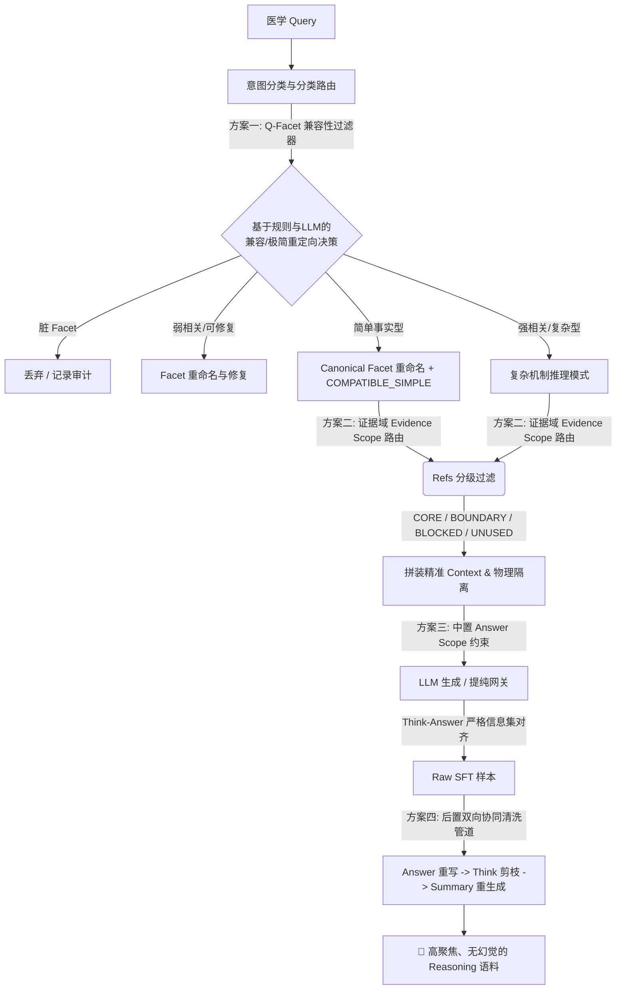

# 医疗 QA 数据集生成管线：企业级相关性治理与全链路防御重构方案 (v1.1)

## 1. 架构愿景与设计目标

在医疗多轮问答数据集的生成与清洗管线中，**相关性漂移（Topic Drift）**与**证据越界（Evidence Overreach）**是影响微调（SFT）和慢思考（Reasoning CoT）模型质量的核心痛点。

传统的 RAG 粗暴检索和一刀切的 Facet（角度规划）机制，容易诱发模型生成“答非所问、过度推衍、前言不搭后语”的低劣数据。本方案旨在引入**过滤器模式（Filter）**、**策略模式（Strategy）**与**意图路由模型（Intent Router）**，重构全链路数据管道，实现高可读、强扩展、可审计、且能显著降低并审计拦截偏题数据的企业级医学数据治理架构。



---

## 2. 核心模块与设计模式

### 2.1 方案一：前置 Q-Facet 兼容性治理器 (Q-Facet Compatibility Governance)

#### 2.1.1 设计思想
并非所有的医学问题（Q）都适合用所有的医学切面（Planner/Facet）来拆解。对于问“最大剂量”的窄域事实题，强加“药代动力学”、“禁忌人群”等切面，必然逼迫模型生拉硬扯。
我们引入**策略模式 (Strategy Pattern)** 和 **兼容性过滤器**，在生成前进行拦截与重定向。

```python
# 伪代码设计示意：core/governance/facet_strategy.py
from abc import ABC, abstractmethod
from typing import Dict, Any, List

class FacetGovernanceStrategy(ABC):
    """医学切面治理策略基类"""
    @abstractmethod
    async def apply(self, q: str, raw_facet: str, context: Dict[str, Any]) -> Dict[str, Any]:
        pass

class DropDirtyFacetStrategy(FacetGovernanceStrategy):
    """直接删除彻底偏题的脏切面策略"""
    async def apply(self, q: str, raw_facet: str, context: Dict[str, Any]) -> Dict[str, Any]:
        # 记录审计日志，直接返回空，废弃此切面任务
        context["audit_log"].append(f"Pruned facet '{raw_facet}' due to strict incompatibility with Q: '{q}'")
        return {"action": "drop", "facet": None}

class RenameAndRepairStrategy(FacetGovernanceStrategy):
    """偏题但可修复切面：重命名为更宽泛的兼容切面"""
    def __init__(self, target_facet: str):
        self.target_facet = target_facet

    async def apply(self, q: str, raw_facet: str, context: Dict[str, Any]) -> Dict[str, Any]:
        context["audit_log"].append(f"Repaired facet '{raw_facet}' -> '{self.target_facet}' for Q: '{q}'")
        return {"action": "repair", "facet": self.target_facet}

class RedirectToSimpleStrategy(FacetGovernanceStrategy):
    """简单事实题：强制改名为标准规范切面，并重定向至极简推理模式，防止模型过度演绎"""
    def __init__(self, canonical_facet: str):
        self.canonical_facet = canonical_facet

    async def apply(self, q: str, raw_facet: str, context: Dict[str, Any]) -> Dict[str, Any]:
        context["simplify"] = True
        context["compatibility"] = "COMPATIBLE_SIMPLE"
        context["audit_log"].append(
            f"Redirected simple Q: '{q}' with facet '{raw_facet}' -> '{self.canonical_facet}' (COMPATIBLE_SIMPLE)"
        )
        return {"action": "simplify", "facet": self.canonical_facet}
```

#### 2.1.2 混合决策矩阵 (Hybrid Decision Matrix)
为了防止短 Query 导致 LLM 盲目打分偏差，我们采用**“规则意图分类 + LLM 结构化验证决策”**的混合模式：

1.  **第一步（规则意图匹配）**：
    利用正则及匹配规则对 Q 进行快速意图分流，识别出如：`DOSAGE_LIMIT` (剂量)、`COMPONENT` (成分)、`PACKAGING` (包装)、`STORAGE` (贮藏)、`CONTRAINDICATION` (禁忌) 等基础意图。
2.  **第二步（LLM 结构化验证与决策）**：
    基于规则识别的意图，调用 LLM 返回符合以下 Schema 的结构化决策，不单纯依赖打分：
    ```json
    {
      "intent": "DOSAGE_LIMIT",
      "facet_action": "RENAME",
      "target_facet": "剂量用法",
      "compatibility": "COMPATIBLE_SIMPLE",
      "reason": "问题只询问成人每日最大剂量，原 facet 会诱导禁忌人群等不必要的外推"
    }
    ```
3.  **第三步（执行映射）**：
    根据 `facet_action` 分配相应的 `FacetGovernanceStrategy` 实例。如果判定为简单事实题，在重定向至 `COMPATIBLE_SIMPLE` 的同时，**必须将偏题的 raw_facet 强制改名为标准的规范切面（Canonical Facet）**：
    *   剂量/极量题 $\rightarrow$ 改名为 `剂量用法`
    *   成分构成题 $\rightarrow$ 改名为 `成分构成`
    *   贮藏条件题 $\rightarrow$ 改名为 `贮藏条件`
    *   禁忌证相关 $\rightarrow$ 改名为 `禁忌人群`

---

### 2.2 方案二：输入端“证据域作用域（Evidence Scope）”检索路由

#### 2.2.1 痛点与设计思想
大模型在拥有过于庞杂的 `refs`（如整篇说明书的各种禁忌和药代属性）时，很容易将“能用作证据的材料”误当成“最终应该吐出的回答范围”。
我们必须引入独立的**证据作用域（Evidence Scope）**路由对 RAG 召回的知识进行精细化分级，并且**该路由不应该放在 `services/llm_service.py` 传输层中**（防止承载过多业务逻辑），而应作为独立的 `core/rag/evidence_scope_router.py` 存在。

#### 2.2.2 证据分级作用域逻辑控制
根据 Q 的意图类别，将检索出的每一条 Ref 标记为以下四个作用域之一，并在传输前对 Prompt 进行“脱敏”：

```python
# 伪代码设计示意：core/rag/evidence_scope_router.py
from enum import Enum
from pydantic import BaseModel
from typing import List, Dict, Any

class ScopeType(str, Enum):
    CORE = "CORE"            # 核心证据：必须参与推理，必须体现在最终答案中
    BOUNDARY = "BOUNDARY"    # 边界限制：仅限 answer_body 和 think 都最多一句的窄边界
    BLOCKED = "BLOCKED"      # 强制封锁：即使检索到了也严禁碰触，从 prompt 中物理屏蔽，防止反向激活
    UNUSED = "UNUSED"        # 冗余屏蔽：直接从 prompt 排除，不喂给模型
```

*   **对于 `BLOCKED` 和 `UNUSED`**：
    在装配层直接**静默剔除**，根本不送入生成 Prompt 的 `context` 字典中，从物理上切断原料供给。**绝对不能将 BLOCKED 实体的名字写在 System Prompt 的 “Do NOT mention...” 列表里，以防大模型在 Attention 机制下发生反向激活（Reverse Activation）**。只允许在审计日志中记录屏蔽详情。
*   **对于 `BOUNDARY`**：
    约束为“Answer 和 Think 都最多只有一句的窄边界”。Think 不得出现 Answer 中没有被回收的推理支流；若 Answer 中需要一句安全警示，Think 仅能以最短路径推理出这一句话。
*   **对于 `CORE`**：
    在 System Prompt 中强制要求在 Think 与 Answer 中对齐使用。

---

### 2.3 方案三：中置 SFT Prompt 的“Answer Scope 约束”与“强一致性红线”

#### 2.3.1 设计思想
必须保证 Think 和 Answer 的信息边界高度重合。如果 `<think>` 脑补了过敏和肾病，而 `answer_body` 只有一句“最大剂量是 4g”，这对于 Reasoning 微调是有害的。**Think 和 Answer 的信息宽度必须是 100% 对齐的**。

#### 2.3.2 提示词强对齐指令升级
在 `get_purify_system_prompt` 中，注入以下绝对一致性红线：

```markdown
### 🚨 思考链与最终回答一致性红线 (Thinking-Answer Set Congruence)
1. ❌ 绝对禁止“信息不对称”：你最终输出的回答正文（Answer Body）中所提及的每一个临床事实、人群限制、药理机制，都必须在前置的思考过程（Think）中存在严密的逻辑推演轨迹。
2. ❌ 绝对禁止“被删推理残留”：如果某一临床概念（例如：青霉素过敏、孕母禁忌等）由于不属于原问题 Q 的回答范围而在 Answer Body 中被剔除或忽略，那么你前置的思考过程（Think）中也必须彻底清除对此概念的推导。
3. 🔗 窄域收拢规则：你的思考心流（Think）必须全程紧扣原问题 Q，严禁在 Think 中脑补和讨论与 Answer 无关的“旁路临床大道理”。思考流的宽度必须与最终答案的宽度保持 100% 对齐。
```

---

### 2.4 方案四：后置“Answer-Think 协同清洗与逆向重构”

#### 2.4.1 痛点与设计思想
对于数据生成后遗留的偏题数据，或治理存量语料时，不能盲目地将 Think 和 Answer 割裂重写。我们必须执行**“逆向协同清洗（Feedback Co-Purification Pipeline）”**，并遵循严密的数据重构顺序。

#### 2.4.2 协同重构流程设计
针对当前 planner 结果中 `<think>...</think>\n正文` 的混合结构，清洗重构必须遵循以下严格的解析与执行阶段：

```
[步骤 1: 结构解析与提取]
       │  (提取原始 think 和 original answer body)
       ▼
[步骤 2: Answer 窄域重写]
       │  (过滤无关偏题文本，重构为高度聚焦的 Purified Answer)
       ▼
[步骤 3: Think 逆向裁剪]
       │  (以 Purified Answer 为锚点，剪除 Think 中多余的逻辑分支，重写为 Purified Think)
       ▼
[步骤 4: Summary 重新生成]
       │  (基于净化后的 Think & Answer 提炼学术摘要，彻底剥离元叙述)
       ▼
[步骤 5: 实体拼装回落库]
          (拼接为 <think>purified_think</think>\npurified_answer 格式落库)
```

1.  **步骤 1：原始段落稳定解析**：
    从原始数据中用精确正则提取出原始 `think` 与 `answer_body`（正文部分），防止解析失败导致格式损坏。
2.  **步骤 2：Answer 窄域重写**：
    剔除正文由于 Planner 偏题而脑补的冗余文本（如大段的过敏和肾病用药细节），获得极简聚焦的 `Purified Answer`。
3.  **步骤 3：Think 逆向自愈与剪枝**：
    将 `Q`、`Purified Answer` 和 `refs` 送入提纯大模型，在 Prompt 中指示：*“以最终答案 A 为刚性锚定输入，裁剪和修剪思维链（Think）。粗暴剪除 Think 中所有对‘最终答案 A 中未包含之概念’的推理分支，使其成为推导最终答案 A 的最小因果心流。”*
4.  **步骤 4：Summary 重新生成**：
    在 Think 和 Answer 完全对齐净化后，重新生成不带任何元叙述的 Summary 摘要。
5.  **步骤 5：实体拼装落库**：
    按照标准的 `<think>purified_think</think>\npurified_answer` 格式拼接并保存，确保不污染数据集。

---

## 3. 在当前项目中的具体落地改动指引

### 3.1 `core/pipeline_workflow.py` 中的前置重构
*   **改动位置**：在 `workflow` 启动后，分配 Planner 面板的循环中。
*   **改动逻辑**：
    *   在调用大模型生成具体 QA 回答前，引入 `core.governance.facet_strategy` 策略决策器。
    *   结合规则与 LLM 分类完成 `Q-Facet 兼容判定` 与 `重命名/修复/重定向`。
    *   将治理策略应用记录（Action、Reason）写入审计流 `context["audit_log"]`。

### 3.2 新增 `core/rag/evidence_scope_router.py` 模块
*   **职责**：纯粹的业务与数据层。根据问题意图，将召回的 `refs` 标识为 `CORE / BOUNDARY / BLOCKED / UNUSED` 作用域标签。
*   **调用位置**：在 `core/pipeline_workflow.py`（生成阶段）和 `scripts/medicalqa_purifier.py`（提纯阶段）中统一调用该模块。
*   **与 LLM 服务的关系**：[services/llm_service.py](file:///d:/REN/qa/services/llm_service.py) 保持职责单一（SRP），只负责底层 API 交互。它不承载任何意图、Refs 路由的业务逻辑，仅接收由上游 Router 过滤和拼装好的干净 Context。

### 3.3 `scripts/medicalqa_purifier.py` 与 `core/purification_engine.py` 的协同重构
*   **改动逻辑**：
    *   在 `medicalqa_purifier.py` 中，执行严格的**重构依赖顺序**（先解析出 think/answer $\rightarrow$ 重写并窄域化 answer $\rightarrow$ 提纯 think）。
    *   升级 `purification_engine.py`，必须将 `purified_answer` 作为参数传递给 `purify_single_think` 净化引擎，作为 Think 逆向裁剪的锚定参考。

---

## 4. 可审计性与可回滚性保障

### 4.1 全链路审计与日志记录 (Audit Trail)
在每次运行的最终记录文件（如 `purification_run.md`）中，单列 `## 🔍 治理审计报告`，清晰展示每次偏题拦截行为，例：
```markdown
- [QA-2] [禁忌人群] -> 触发 RenameAndRepairStrategy -> 修改切面为: [剂量用法] (COMPATIBLE_SIMPLE) | 原因: 主问题仅涉及最大剂量数值。
- [QA-2] [Refs 过滤] -> 4条 refs 中，1条归为 CORE，2条归为 BLOCKED (直接剔除防反向激活)，1条归为 UNUSED。
```

### 4.2 可回滚机制 (Rollback Mechanism)
如果后置协同清洗（Answer-Think 逆向重构）打分未通过 Quality Gate 门禁，系统必须保留该数据的**原始备份（Raw Backup）**，将该 QA 记录恢复到未净化状态，并生成失败日志投递到审计系统，防止污染冷启动微调库。
