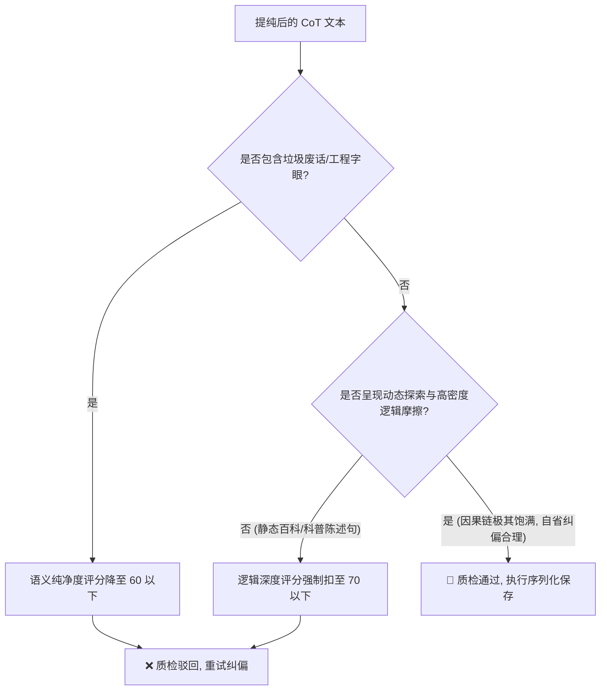

# 🧠 高熵“逻辑跃迁”思维摩擦词与元认知控制规范手册
*(High-Entropy "Logic-Jump" Cognitive Friction Words & Metacognitive Control Specification Manual)*

在大模型思维链（CoT）及 Reasoning 模型（如 DeepSeek-R1、OpenAI o1）的 SFT 微调数据工程中，传统的“静态陈述体”数据（即平铺直叙地背诵“A是B，C的机制是D”）会导致模型在推理时严重缺乏**深度因果阻尼与自主纠错能力**。

为了激活模型在推理时的**“慢思考（System 2）”**，我们必须在思维链中注入**高熵、带有因果破缺与元认知自省色彩的“逻辑摩擦关联词”**。这些词汇不仅拉长了自回归生成的物理计算空间，更充当了模型注意力矩阵的“转向开关”，强制模型回溯并修正盲区。

本手册详细整理了五大认知阶段下的高熵摩擦词，并确立了**元认知与垃圾废话的生死界限**。

---

## 📊 五大认知阶段的高熵思维摩擦词库

### 阶段一：核心矛盾解构与破局 🔍
*在思考起点，直插临床/药理矛盾核心，打破废话开场白，建立探索态势。*

| 摩擦词 / 句式 | 认知功能（大模型在想什么） | 临床场景应用范例 |
| :--- | :--- | :--- |
| **“要剖析……首先必须解构……”** | 物理拆解复合实体的底层结构 | *“要剖析丹膝颗粒的药理学机制，首先必须解构其核心临床目标：‘瘀血阻络兼肾虚证’。”* |
| **“……的本源在于……”** | 剥离表面症状，直击病生理源头 | *“非洛地平禁忌症的本源在于，其阻滞 L型钙通道所带来的强效血管舒张效应。”* |
| **“这就引出了一个核心冲突：……”** | 确立推理链需要攻克的焦点矛盾 | *“这就引出了一个核心冲突：利多卡因的辅料中虽有注射用水，但稀释时却绝对禁止使用。”* |
| **“看似……实则……”** | 击碎常识性误区，开启深度演绎 | *“格拉司琼在肾损患者中的应用，看似肾脏排泄占比极低，实则其高浓度代谢物的蓄积风险不可忽视。”* |
| **“矛盾焦点在于，……”** | 明确多靶点联合作用的物理边界 | *“矛盾焦点在于，如何在不触发全身突释毒性的前提下，实现局部麻醉的长效缓释。”* |

---

### 阶段二：微观病生理因果咬合 🧬
*高硬度地在分子靶点、受体化学、体内药代动力学参数之间建立“强力齿轮咬合”。*

| 摩擦词 / 句式 | 认知功能（大模型在想什么） | 临床场景应用范例 |
| :--- | :--- | :--- |
| **“既然……必然……”** | 从前提（A）到推论（B）的绝对逻辑跃迁 | *“既然核心矛盾是‘瘀血’，那么方剂中丹参、赤芍的配伍必然指向抗血小板聚集的通路。”* |
| **“由此推导，……”** | 沿病理学路径进行顺向逻辑滑行 | *“霍乱毒素导致肠上皮细胞内 cAMP 激增，由此推导，临床上必然引发暴发性的米泔水样剧烈腹泻。”* |
| **“在……机制下，势必……”** | 阐明分子生物学与器官功能的强相关性 | *“在 PXR 受体被激活的机制下，势必导致下围 UGT2B7 酶表达的显著上调。”* |
| **“这直接导致了……”** | 建立物理病理变化与宏观临床表现的刚性因果 | *“原型药清除率骤降，这直接导致了其体内半衰期被显著拉长，暴露量成倍增加。”* |
| **“其底层逻辑可归结为：……”** | 将复杂的临床表现收拢于一处药理学真理 | *“火麻仁对于脑卒中偏瘫患者的临床意义，其底层逻辑可归结为：通过稳定腹压间接保护脑部微循环。”* |

---

### 阶段三：逻辑分叉与多路检验 🔀
*在推理中段强制模型进行多分支路径排查，这是高熵 CoT 最具智慧的“逻辑熵”来源。*

| 摩擦词 / 句式 | 认知功能（大模型在想什么） | 临床场景应用范例 |
| :--- | :--- | :--- |
| **“然而，仅靠……是不够的……”** | 引入协同靶点、复方配伍或多器官关联 | *“然而，仅靠活血化瘀是不够的，中风后遗症常伴随长期的机体耗损，补肾填精是必须的另一根骨架。”* |
| **“慢着，此时必须评估：……”** | 踩下刹车，主动排查特定生理状态下的安全边界 | *“慢着，此时必须评估：当患者存在重度低蛋白血症时，高度蛋白结合的药物游离浓度是否会异常升高？”* |
| **“如果是遇到……的特殊情况呢？”** | 主动引入基因多态性、极端年龄或脏器受损变数 | *“如果是遇到 CYP2C19 慢代谢基因型的极特殊患者呢？此时常规剂量极易诱发突发毒性。”* |
| **“我们必须排除……的可能性，因为……”** | 执行鉴别诊断或反向排查法 | *“我们必须排除肠道本身器质性病变的可能性，因为不加区分的通便可能诱发穿孔风险。”* |
| **“硬币的另一面是，……”** | 审视药物效用与毒性、风险与获益的对立统一体 | *“硬币的另一面是，该药的抗真菌谱虽广，但对足放线菌和镰刀菌的体外活性极易受耐药基因的干扰。”* |

---

### 阶段四：安全极限与元认知纠偏 🛡️
*大模型在思考中段的“急刹车”、“回溯重构”和“自我打脸”，是 Reasoning 模型自主纠错能力的开关。*

| 摩擦词 / 句式 | 认知功能（大模型在想什么） | 临床场景应用范例 |
| :--- | :--- | :--- |
| **“等一下，这里有个关键盲区：……”** | 揪出自己刚才粗暴推理中的致命事实错误 | *“等一下，这里有个关键盲区：克柔念珠菌对氟康唑是天然耐药，而非常规的获得性耐药，这意味着一线氟康唑方案必须被当场枪毙。”* |
| **“刚才的推论可能过于绝对，因为……”** | 展现科学谦逊，限制结论的绝对化外延 | *“刚才的推论可能过于绝对，因为体外抑菌率并不等同于体内清除率，仍需警惕免疫机制的介入。”* |
| **“必须引入……安全防线，以防……”** | 从药效学危害倒逼出临床监护红线 | *“一旦 QTc 间期发生进行性延长，必须引入心电监护这一绝对防线，以防尖端扭转室速的发生。”* |
| **“若执意……则可能招致……的灾难性风险”** | 强化对错误给药途径/错误配伍危害 of 预警 | *“若执意使用注射用水进行稀释，则可能招致脂质体溶胀破裂、局部麻醉药突释的灾难性风险。”* |
| **“基于循证限制，我们不得不将……降级为……”** | 面对证据不足时，极具临床理性的“循证降级” | *“基于循证限制，我们不得不将这一强效推荐降级为‘在严密肾功监测下的审慎试用’。”* |

---

### 阶段五：决策合拢与学术闭环 ⚖️
*拒绝“综上所述”、“因此最终结论是”等庸俗套话，以高度学术的形式让结论自然水落石出。*

| 摩擦词 / 句式 | 认知功能（大模型在想什么） | 临床场景应用范例 |
| :--- | :--- | :--- |
| **“这就完美解释了为何……”** | 将先前所有的分支推理，最终收拢于一个底层真理 | *“这就完美解释了为何说明书将 12 岁作为绝对分界线：因为此时儿童的肝脏清除半衰期已接近成人。”* |
| **“各项指标最终汇聚于一个反复权衡的临床天平上：……”** | 将错综复杂的表现化解为高屋建瓴的“获益-风险天平” | *“所有的临床指标，最终都要回归到一个反复权衡的天平上：止吐获益是否压倒了器官蓄积的潜在事件风险。”* |
| **“综合上述因果闭环，……”** | 将分子学、病理学与临床表现锁死，完成自然闭环 | *“综合上述因果闭环，其适应症实质上是针对具有侵袭性生长和血行播散潜能的特定深部真菌感染。”* |
| **“这种在不确定性中寻找安全边界的过程，正是……”** | 对证据模糊地带的最佳逻辑总结，提升思维链的思想深度 | *“这种在循证空白中，通过严密监测寻找安全窗口的过程，正是复杂病例诊断的最佳临床推理。”* |

---

## 🎯 SFT 数据工程黄金法则：元认知自省 vs. 垃圾废话的生死线

为了防止在微调中用力过猛，导致模型退化为“话痨综合征”或“废话大王”，数据清洗管道（Data Cleansing Pipeline）必须严密监管以下分界线：

### 🛑 垃圾废话（必须彻底干掉）
1. **口头禅与唠嗑语气**：`“哈哈，让我想想...”`、`“哇，这个问题很有意思...”`、`“好的，我明白了您的意思...”`。
2. **低级智障式自我纠偏**：`“等一下，不对，这药是中成药吗？哦，它是的，刚才我看错了。”`（无逻辑跨越的废话）
3. **元命令复读与格式避让**：`“我需要输出一个 JSON 格式，首先来看 evidences...”`、`“我们需要从临床视角出发...”`。

### 🟢 黄金元认知（必须保留和鼓励）
1. **因果关系的极限试探**：*“如果……那么……但如果……又会怎样？”*
2. **基于病生理事实的自我回溯**：*“等一下，克柔念珠菌与白念珠菌的机制不同，前者的天然耐药属性意味着……刚才的常规推论在此处并不适用。”*
3. **临床安全防线的推理阻碍**：在推理时**“主动遇到红线刹车”**，并解释物理机制。

---

## 🛠️ 数据管道中的 Judge LLM 判分对齐

在智能质检裁判大模型中，必须通过以下判分矩阵强制过滤：

这套标准确保了数据既有**高熵的“思考痕迹”**，又有**绝对的“事实纯净度”**，是 Reasoning 时代冷启动微调当之无愧的灵魂级语料！
