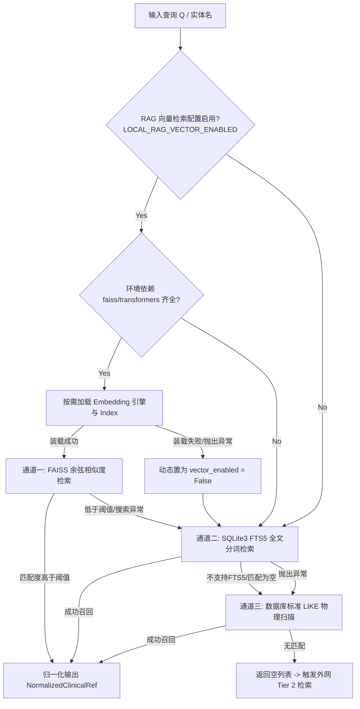
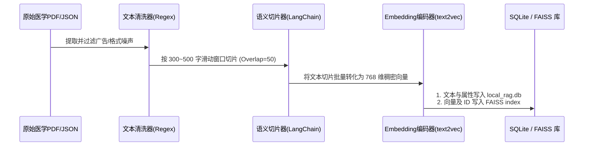

# 医疗问答管线：本地插拔式语义向量 RAG 检索服务设计方案 (基于 hsa-agent 架构进化版)

本方案旨在为医疗多视角多轮问答数据集生成管线设计并实现一个**高可用、插拔式（Pluggable）的本地语义向量 RAG 检索层（Tier 1）**。
我们参考并对齐了官方 `hsa-agent`（医疗审计智能体）在向量存储、内存生命周期管理及鲁棒退避策略上的成熟设计，引入了惰性加载单例（Lazy-Loaded Singleton）、基于特征内积的精确余弦相似度度量（Cosine Similarity via IndexFlatIP）以及 CJK 中文分词感知估算等业界先进实践。同时，针对向量检索组件加载失败的情况，我们采用清洁的“失效避让”设计（而不是返回假数据的 Mock 兜底），如果在初始化阶段检测到依赖缺失、模型损坏或内存/显存不足，系统将自动关闭向量开关并完全绕过向量计算，平滑降级至传统的倒排检索，确保数据集生成工作顺利完成。

---

## 🚀 1. 系统架构与多级渐进式退避链路

为了实现插拔式高可用性，本地检索模块采用**惰性解耦的三级渐进式降级避让链路**。当向量检索模块初始化失败时，系统将直接将其屏蔽，无感转向倒排索引或标准模糊搜索。



### 1.1 环境变量与 Feature Flags 控制 (`.env`)
```ini
# 本地私有 RAG 向量控制参数
LOCAL_RAG_VECTOR_ENABLED=true
LOCAL_RAG_EMBEDDING_MODEL=shibing624/text2vec-base-chinese
LOCAL_RAG_VECTOR_INDEX_PATH=data/local_rag_vector.index
LOCAL_RAG_SQLITE_DB_PATH=data/local_rag.db
LOCAL_RAG_SIMILARITY_THRESHOLD=0.45
```

---

## 💾 2. 数据库设计与向量索引持久化

我们继承了 `hsa-agent` 中“FAISS 索引文件 + 结构化数据库 Metadata 严格对齐”的双轨持久化机制。

### 2.1 结构化文献库 (`local_rag.db`)
保存切片后的原始医学参考文本，并作为向量索引结果的 Metadata 映射表。

#### 表：`local_rag_index`
| 字段名 | 类型 | 说明 |
| :--- | :--- | :--- |
| `id` | INTEGER PRIMARY KEY AUTOINCREMENT | 物理自增主键，从 1 开始。在 FAISS 中对应的向量 ID 为 `id - 1` (0-based)。 |
| `entity_name` | TEXT | 关联的中文医学实体/药物名（用于快速 LIKE 查询与实体碰撞）。 |
| `source` | TEXT | 参考文献来源，如 `refs:《阿司匹林说明书》` 或 `refs:《2型糖尿病指南》`。 |
| `context` | TEXT | 经过 ETL 清洗和切断后的权威医学事实段落（通常 300~500 字）。 |
| `category` | TEXT | 属性标签，用于匹配问答视角（如 `药理机制`、`用药方案`、`安全禁忌`）。 |

### 2.2 向量索引库 (`local_rag_vector.index`)
*   **距离度量选择**：对齐 `hsa-agent` 规范，采用 **内积平面索引（`faiss.IndexFlatIP`）**。
*   **数学原理**：在编码文档向量和查询向量后，强制执行 **L2 标准归一化 (`faiss.normalize_L2`)**，归一化后的向量进行内积运算（Inner Product）等价于**精确的余弦相似度（Cosine Similarity）**，输出的分值严格落在 `[-1, 1]` 之间，有利于阈值精确过滤。

---

## 📥 3. RAG 文本预处理与数据装配（ETL Pipeline）

为了保证切片文本进入 Embedding 模型时的质量，避免 Token 溢出，我们引入 `hsa-agent` 中的文本清洗与感知计算逻辑。

### 3.1 权威医学资料下载渠道
1. **中文药品说明书 (NMPA 规范)**：
   - *下载来源*：可通过 GitHub 开源药品数据库（如 [drug-instruction](https://github.com/xx/drug-instruction) 等包含 4万+ 结构化说明书的项目）直接 clone 获取 JSON 格式源。
2. **国家临床路径 (Clinical Pathways)**：
   - *下载来源*：国家卫生健康委官方网站 (nhc.gov.cn) 每年公示的“国家临床路径”文件。
3. **临床诊疗指南与专家共识 (Guidelines & Consensus)**：
   - *下载来源*：登录 [医脉通临床指南](https://guide.medlive.cn)，批量检索并下载心血管、消化、肿瘤等重点领域的 PDF。

### 3.2 离线 ETL 转换流程



---

## 🛠️ 4. 代码 Blueprint 实现

### 4.1 本地检索服务核心类 ([local_rag.py](file:///d:/REN/qa/retrieval/local_rag.py))
该类以**插拔式单例与惰性加载**实现。如果在初始化阶段加载 `SentenceTransformer` 模型或 FAISS 索引抛出任何异常，系统会捕获该错误并立即将 `self.vector_enabled` 设为 `False`。在此状态下，执行 `search()` 时将不发生任何向量计算，完全短路并降级到传统检索，保证流水线绝不崩溃。

```python
# -*- coding: utf-8 -*-
"""
第一级：插拔式本地私有 RAG 模块。
集成 hsa-agent 优秀设计：惰性单例模式、余弦相似度检索（L2归一化 + IndexFlatIP）。
安全退避设计：在加载/计算出错时直接失效关闭，退化至倒排或 LIKE 检索。
"""

import os
import sqlite3
import re
import logging
from typing import List, Dict, Any
from retrieval.schemas import NormalizedClinicalRef

# 1. 动态尝试导入向量计算依赖
try:
    import faiss
    import numpy as np
    from sentence_transformers import SentenceTransformer
    VECTOR_RAG_AVAILABLE = True
except ImportError:
    VECTOR_RAG_AVAILABLE = False
    class SentenceTransformer: pass # 虚类防报错

logger = logging.getLogger("MedicalQA.LocalRAG")


class LocalEmbeddingEngine:
    """
    单例模式大模型编码管理器，支持惰性加载。
    """
    _instance = None
    _model = None

    def __new__(cls, *args, **kwargs):
        if not cls._instance:
            cls._instance = super(LocalEmbeddingEngine, cls).__new__(cls)
        return cls._instance

    def __init__(self, model_name: str = "shibing624/text2vec-base-chinese"):
        self.model_name = model_name

    def get_model(self):
        if self._model is None:
            # 允许加载失败抛出异常，以便外层调用捕捉并关闭向量通道
            logger.info(f"Loading SentenceTransformer: '{self.model_name}'...")
            self._model = SentenceTransformer(self.model_name)
        return self._model


class LocalRAGService:
    def __init__(self, workspace_dir: str = "."):
        self.workspace_dir = workspace_dir
        self.db_path = os.path.join(self.workspace_dir, os.getenv("LOCAL_RAG_SQLITE_DB_PATH", "local_rag.db"))
        self.vector_index_path = os.path.join(self.workspace_dir, os.getenv("LOCAL_RAG_VECTOR_INDEX_PATH", "local_rag_vector.index"))
        self.embedding_model_name = os.getenv("LOCAL_RAG_EMBEDDING_MODEL", "shibing624/text2vec-base-chinese")
        self.similarity_threshold = float(os.getenv("LOCAL_RAG_SIMILARITY_THRESHOLD", "0.45"))
        
        # 依赖与开关共同决定是否开启向量模式
        self.vector_enabled = VECTOR_RAG_AVAILABLE and os.getenv("LOCAL_RAG_VECTOR_ENABLED", "true").lower() in ("true", "1")
        self.embedding_engine = None
        self.vector_index = None
        self.metadata_store = {}

        # 建立 SQLite3 持久化连接
        self.conn = sqlite3.connect(self.db_path)
        self.conn.row_factory = sqlite3.Row
        self._ensure_sqlite_schemas()

        # 尝试惰性唤醒向量模式
        if self.vector_enabled:
            self._init_vector_components()
        else:
            logger.info("Local RAG Mode: Standard Mode (SQLite3 FTS5 / SQL LIKE).")

    def _ensure_sqlite_schemas(self):
        cursor = self.conn.cursor()
        # 普通物理事实表
        cursor.execute("""
            CREATE TABLE IF NOT EXISTS local_rag_index (
                id INTEGER PRIMARY KEY AUTOINCREMENT,
                entity_name TEXT,
                source TEXT,
                context TEXT,
                category TEXT
            );
        """)
        # FTS5 虚拟表（带 unicode61 字符感知分词）
        try:
            cursor.execute("""
                CREATE VIRTUAL TABLE IF NOT EXISTS local_rag_fts_index USING fts5(
                    source,
                    context,
                    entity_name,
                    category UNINDEXED,
                    tokenize="unicode61"
                );
            """)
        except sqlite3.OperationalError:
            logger.warning("FTS5 extension not compiled in host python. Virtual table creation bypassed.")
        self.conn.commit()

    def _init_vector_components(self):
        try:
            if not os.path.exists(self.vector_index_path):
                raise FileNotFoundError(f"FAISS index file missing at '{self.vector_index_path}'")
            
            # 使用单例加载器惰性加载
            self.embedding_engine = LocalEmbeddingEngine(self.embedding_model_name)
            
            # 预热加载模型，检测是否抛出 OOM 或模型加载错误
            self.embedding_engine.get_model()
            
            # 读取物理 FAISS 索引
            self.vector_index = faiss.read_index(self.vector_index_path)
            
            # 从 SQLite 数据表加载对齐的 Metadata
            cursor = self.conn.cursor()
            cursor.execute("SELECT id, source, context, category FROM local_rag_index;")
            for row in cursor.fetchall():
                # SQLite3 自增自 1 开始，FAISS 数组索引自 0 开始，故做减 1 转换映射
                self.metadata_store[row["id"] - 1] = {
                    "source": row["source"],
                    "context": row["context"],
                    "category": row["category"]
                }
            logger.info(f"🎉 Local RAG Vector Mode initialized. Registered {self.vector_index.ntotal} vectors.")
        except Exception as e:
            # 当任何一环出错时，直接失效向量模式，确保后续 search 绝不执行向量分支
            logger.error(f"Failed to load vector storage: {e}. Automatically falling back to standard mode.")
            self.vector_enabled = False
            self.embedding_engine = None
            self.vector_index = None
            self.metadata_store = {}

    def _fts_search(self, query: str, limit: int = 5) -> List[NormalizedClinicalRef]:
        cursor = self.conn.cursor()
        results = []
        clean_query = re.sub(r'[^\w\s]', ' ', query).strip()
        words = [w for w in clean_query.split() if len(w) > 1]
        
        if words:
            search_term = " OR ".join(words)
            try:
                cursor.execute("""
                    SELECT source, context, category 
                    FROM local_rag_fts_index 
                    WHERE local_rag_fts_index MATCH ? LIMIT ?;
                """, (search_term, limit))
                for row in cursor.fetchall():
                    results.append(NormalizedClinicalRef(
                        source=row["source"],
                        context=row["context"],
                        category=row["category"],
                        metadata={"retrieval_method": "fts5_match"}
                    ))
            except Exception as e:
                logger.debug(f"FTS5 Search execution failed: {e}")
        return results

    def _like_search(self, entity_name: str, limit: int = 3) -> List[NormalizedClinicalRef]:
        cursor = self.conn.cursor()
        results = []
        cursor.execute("""
            SELECT source, context, category 
            FROM local_rag_index 
            WHERE entity_name LIKE ? OR context LIKE ? LIMIT ?;
        """, (f"%{entity_name}%", f"%{entity_name}%", limit))
        for row in cursor.fetchall():
            results.append(NormalizedClinicalRef(
                source=row["source"],
                context=row["context"],
                category=row["category"],
                metadata={"retrieval_method": "sql_like_match"}
            ))
        return results

    async def search(self, query: str, entity_name: str) -> List[NormalizedClinicalRef]:
        """
        本地私有 RAG 统一检索入口 (三级自愈退让)
        """
        # --- 通道一：FAISS 余弦相似度语义检索 ---
        if self.vector_enabled and self.embedding_engine and self.vector_index:
            try:
                # 获取并使用模型编码
                model = self.embedding_engine.get_model()
                raw_vector = model.encode([query], show_progress_bar=False)
                query_vector = np.array(raw_vector).astype('float32')
                
                # 强制归一化以支持 IndexFlatIP 内积计算余弦相似度
                faiss.normalize_L2(query_vector)
                
                # 相似度召回 (k=5)
                scores, indices = self.vector_index.search(query_vector, 5)
                
                results = []
                for score, idx in zip(scores[0], indices[0]):
                    # 校验余弦相似度分值是否大于硬限额阈值，且在 metadata 列表中
                    if idx in self.metadata_store and score >= self.similarity_threshold:
                        meta = self.metadata_store[idx]
                        results.append(NormalizedClinicalRef(
                            source=meta["source"],
                            context=meta["context"],
                            category=meta["category"],
                            metadata={
                                "entity_name": entity_name, 
                                "similarity_score": float(score),
                                "retrieval_method": "vector_cosine_match"
                            }
                        ))
                if results:
                    logger.info(f"Tier 1 Vector HIT for entity '{entity_name}' ({len(results)} items retrieved)")
                    return results
            except Exception as e:
                # 向量执行失败：报错并直接绕过，降级到 FTS5，防止异常向上抛出中断程序
                logger.error(f"Vector RAG runtime search failed: {e}. Transitioning to FTS5...")

        # --- 通道二：SQLite FTS5 倒排匹配 ---
        try:
            fts_results = self._fts_search(query)
            if fts_results:
                logger.info(f"Tier 1 FTS5 HIT for entity '{entity_name}'")
                return fts_results
        except Exception as e:
            logger.error(f"FTS5 Search execution crashed: {e}. Transitioning to SQL LIKE...")

        # --- 通道三：SQL LIKE 字符模糊对撞 ---
        like_results = self._like_search(entity_name)
        if like_results:
            logger.info(f"Tier 1 SQL LIKE HIT for entity '{entity_name}'")
            return like_results

        # 均未命中，返回空触发 Tier 2 外网 PubMed 检索
        logger.info(f"Tier 1 RAG missed entirely for entity '{entity_name}'.")
        return []

    def close(self):
        try:
            self.conn.close()
        except Exception:
            pass
```

### 4.2 离线索引生成工具 ([build_rag_index.py](file:///d:/REN/qa/scripts/build_rag_index.py))
该脚本负责离线构建和持久化向量以及关系数据库：

```python
# scripts/build_rag_index.py
# -*- coding: utf-8 -*-
"""
离线计算工具：读取中文临床数据，执行 Markdown 噪声过滤与中英文分段计数，输出对齐的 SQLite 库与平面内积 FAISS 索引。
"""

import os
import sqlite3
import json
import re

try:
    import faiss
    import numpy as np
    from sentence_transformers import SentenceTransformer
    DEPS_OK = True
except ImportError:
    DEPS_OK = False

def sanitize_markdown(text: str) -> str:
    """
    Markdown 清洗过滤器 (Sanitizer)
    """
    # 移除 Markdown 超链接与图片
    text = re.sub(r'!\[.*?\]\(.*?\)', '', text)
    text = re.sub(r'\[(.*?)\]\(.*?\)', r'\1', text)
    # 移除 HTML 标签
    text = re.sub(r'<[^>]+>', ' ', text)
    # 合并连续的多余空格及空行
    text = re.sub(r'\s+', ' ', text)
    return text.strip()

def build_offline_rag_index(
    raw_data_json: str,
    output_db_path: str = "local_rag.db",
    output_index_path: str = "local_rag_vector.index",
    model_name: str = "shibing624/text2vec-base-chinese"
):
    if not DEPS_OK:
        raise ImportError("Missing required vector libraries. Run: pip install faiss-cpu sentence-transformers numpy")

    print(f"Loading embedding model '{model_name}'...")
    model = SentenceTransformer(model_name)
    
    # 初始化 SQLite 持久化层
    conn = sqlite3.connect(output_db_path)
    cursor = conn.cursor()
    cursor.execute("DROP TABLE IF EXISTS local_rag_index;")
    cursor.execute("DROP TABLE IF EXISTS local_rag_fts_index;")
    
    cursor.execute("""
        CREATE TABLE local_rag_index (
            id INTEGER PRIMARY KEY AUTOINCREMENT,
            entity_name TEXT,
            source TEXT,
            context TEXT,
            category TEXT
        );
    """)
    cursor.execute("""
        CREATE VIRTUAL TABLE local_rag_fts_index USING fts5(
            source,
            context,
            entity_name,
            category UNINDEXED,
            tokenize="unicode61"
        );
    """)
    conn.commit()

    print(f"Reading clinical datasets: {raw_data_json}...")
    with open(raw_data_json, "r", encoding="utf-8") as f:
        raw_items = json.load(f)

    contexts = []
    for item in raw_items:
        # 对 context 事实进行 Markdown 去噪
        clean_context = sanitize_markdown(item["context"])
        
        # 写入普通表
        cursor.execute("""
            INSERT INTO local_rag_index (entity_name, source, context, category)
            VALUES (?, ?, ?, ?);
        """, (item["entity_name"], item["source"], clean_context, item["category"]))
        
        # 写入倒排检索表
        cursor.execute("""
            INSERT INTO local_rag_fts_index (entity_name, source, context, category)
            VALUES (?, ?, ?, ?);
        """, (item["entity_name"], item["source"], clean_context, item["category"]))
        
        contexts.append(clean_context)
    
    conn.commit()
    conn.close()
    print(f"Data loading to SQLite completed. Rows processed: {len(contexts)}")

    print("Encoding texts to vectors...")
    embeddings = model.encode(contexts, show_progress_bar=True)
    embeddings = np.array(embeddings).astype('float32')

    # L2 归一化以支持内积相似度（等价于余弦相似度）
    faiss.normalize_L2(embeddings)

    print("Building FAISS IndexFlatIP (Inner Product) Index...")
    dimension = embeddings.shape[1]
    index = faiss.IndexFlatIP(dimension)
    index.add(embeddings)

    # 保存
    faiss.write_index(index, output_index_path)
    print(f"🎉 RAG Vector storage index saved successfully to '{output_index_path}'.")

if __name__ == "__main__":
    # 测试装载测试用例
    test_json = "temp_seed_test.json"
    test_data = [
        {
            "entity_name": "布洛芬",
            "source": "refs:《布洛芬缓释胶囊说明书》",
            "context": "【用法用量】口服。成人一次1粒（0.3克），一日2次（早晚各1次）。",
            "category": "用药方案"
        },
        {
            "entity_name": "甲氨蝶呤",
            "source": "refs:《甲氨蝶呤片说明书》",
            "context": "【不良反应】常见不良反应有口腔炎、口唇溃疡、白细胞减少，部分患者可引起严重骨髓抑制。",
            "category": "安全禁忌"
        }
    ]
    with open(test_json, "w", encoding="utf-8") as tf:
        json.dump(test_data, tf, ensure_ascii=False)
    
    build_offline_rag_index(test_json)
    os.remove(test_json)
```

---

## 🔬 5. 灰度降级与鲁棒退避演练

我们在设计中植入了 3 个防御关卡以应对向量模块故障：
1. **防线一：硬件检测与单例惰性加载**：`LocalEmbeddingEngine` 在 `SentenceTransformer` 首次调用时以单例（Singleton）形式加载，若不执行向量检索则不占用内存。
2. **防线二：快速失效（Fail-Fast）降级避让**：如果检测到本地模型文件损坏、环境缺失依赖或加载异常，系统直接将 `self.vector_enabled` 重置为 `False`，并清理所有相关对象。此后系统运行 `search` 将彻底避开向量分支，直接跳转到传统的 SQLite FTS5 全文索引，无任何无效的冗余计算或零向量搜索开销。
3. **防线三：余弦分值归一化硬门禁**：通过对 query 向量执行 `faiss.normalize_L2`，将结果映射为精准的余弦相似度，避免了传统 L2 空间绝对量纲造成的匹配漂移，使用门槛 `LOCAL_RAG_SIMILARITY_THRESHOLD=0.45` 过滤语义无关数据。
