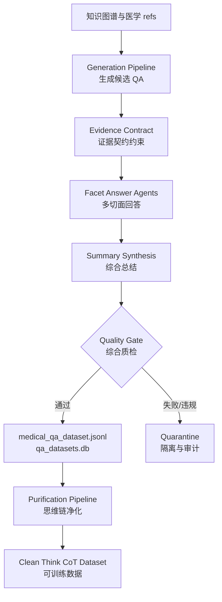
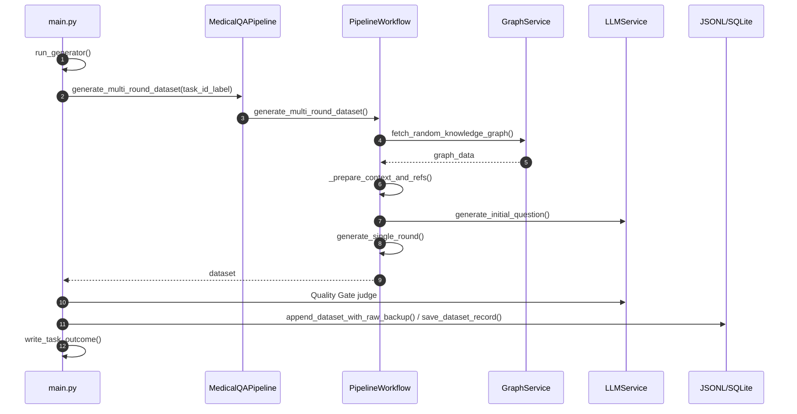
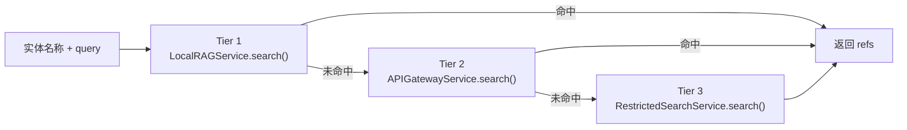
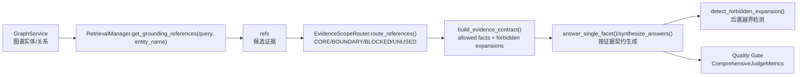
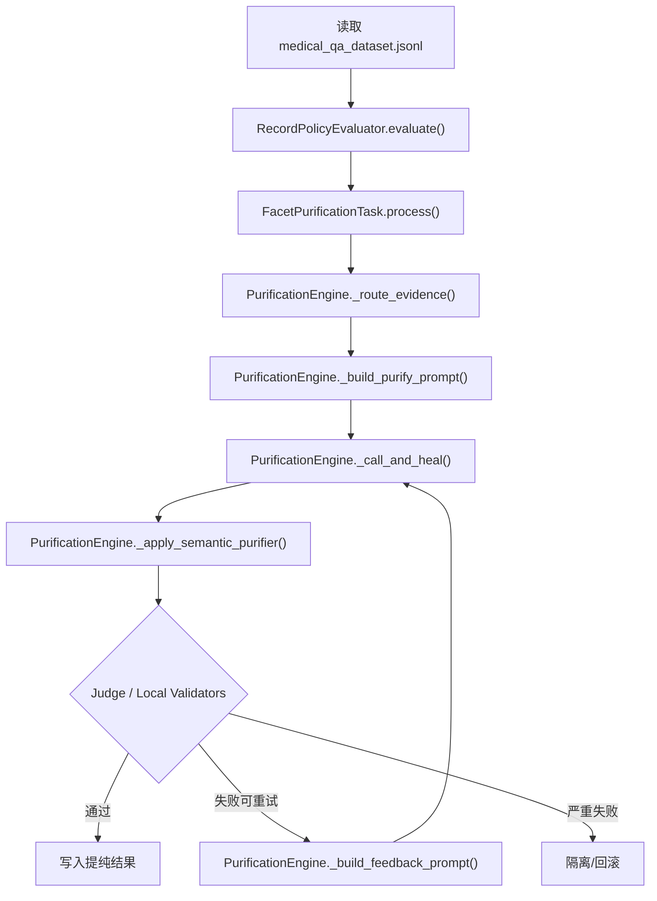
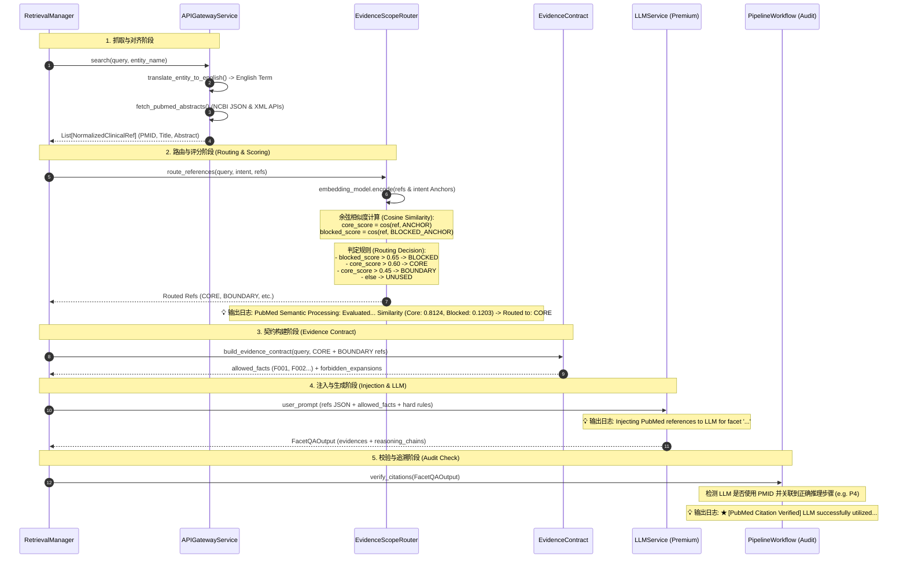
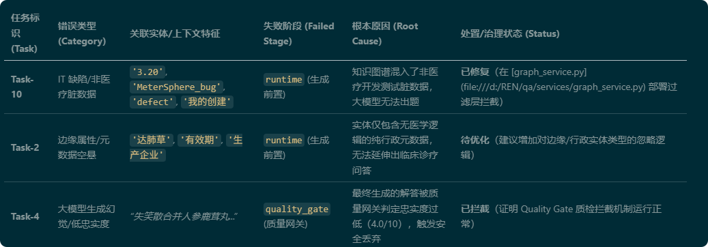

# 医疗 Think CoT QA 数据生成与净化项目说明文档


## 1. 项目一句话说明

本项目是一个面向医疗推理模型训练的数据工程系统，用知识图谱、医学 refs、多模型生成、证据契约和质量门禁，自动生成并净化可用于 Think CoT/SFT 微调的医疗多视角 QA 数据。

项目的核心目标不是“让大模型多写一些答案”，而是让每条训练数据满足三件事：

1. 问题有真实推理深度，不是单跳事实查询。
2. 回答和 think 内容被证据约束，不凭空补药代、机制、替代药或临床研究。
3. 每个样本的生成、失败、隔离和入库过程都可追踪、可审计、可复盘。

---

## 2. 项目要解决的问题

### 2.1 医疗 CoT 数据生成的主要风险

| 风险 | 典型表现 | 项目中的治理方式 | 关键代码 |
| :--- | :--- | :--- | :--- |
| 问题太浅 | “用法用量是什么”“不良反应有哪些” | 问题复杂度门控 | `core.pipeline_workflow.is_fact_retrieval_question()` |
| JSON 格式失败 | LLM 输出 `think` 时引入未转义引号，导致解析失败 | 安全 JSON 解析与 questions 兜底抽取 | `pipeline.parse_json_safely()`、`pipeline.extract_questions_fallback()` |
| Facet 强套 | 简单剂量题强行规划“分子机制” | Q-Facet 兼容治理 | `FacetGovernanceFilter.evaluate_compatibility()` |
| 证据越界 | refs 没有 CYP/AUC，却生成 CYP3A4、AUC 增加 40% | 证据契约与禁止外推检测 | `build_evidence_contract()`、`detect_forbidden_expansion()` |
| 随意拒答 | refs 有证据，但模型说“无证据无法回答” | Quality Gate 召回率/成功度评分 | `build_quality_gate_audit()`、`ComprehensiveJudgeMetrics` |
| 失败不可追踪 | 终端只显示 Failed，但不知道死在哪 | 单任务 outcome 审计 | `write_task_outcome()` |

---

## 3. 全局架构

系统分成两条主线：

1. **Generation Pipeline**：从图谱/refs 出发，生成多视角、多轮、带 think 的 QA 数据。
2. **Purification Pipeline**：对已生成的数据做离线思维链提纯、事实边界收缩和质量门禁。



---

## 4. Generation Pipeline 代码级流程

生成主流程由 `main.py` 启动，真正的业务编排在 `core/pipeline_workflow.py` 的 `PipelineWorkflow` 中完成。`pipeline.py` 是兼容旧接口的代理层。

### 4.1 入口与并发调度

| 功能 | 文件 | 类/方法 |
| :--- | :--- | :--- |
| 批量启动任务 | `main.py` | `run_generator()` |
| 单任务生成、质检、入库/隔离 | `main.py` | `generate_and_save_single_task()` |
| 兼容旧 Pipeline 接口 | `pipeline.py` | `MedicalQAPipeline` |
| 核心生成工作流 | `core/pipeline_workflow.py` | `PipelineWorkflow` |
| LLM 调用封装 | `services/llm_service.py` | `LLMService.call_llm()`、`call_llm_structured()`、`call_llm_with_reasoning()` |
| 图谱获取 | `services/graph_service.py` | `GraphService.fetch_random_knowledge_graph()` |



---

## 5. 生成阶段详细分解

### 5.1 图谱获取与 refs 构建

这一阶段把知识图谱实体、关系和分层检索结果组装成两类数据：

- `context_list`：用于问题生成。
- `refs`：用于回答、证据契约和后续质检。

| 功能 | 文件 | 类/方法 |
| :--- | :--- | :--- |
| 获取随机图谱 | `services/graph_service.py` | `GraphService.fetch_random_knowledge_graph()` |
| 合并实体/关系重复记录 | `services/graph_service.py` | `merge_records()` |
| 构造 context_list 和 refs | `core/pipeline_workflow.py` | `PipelineWorkflow._prepare_context_and_refs()` |
| 三级检索补充 grounding refs | `retrieval/retrieval_manager.py` | `RetrievalManager.get_grounding_references()` |

三级检索逻辑：



---

### 5.2 初始问题生成与复杂度门控

问题生成的目标是构造适合 Think CoT 训练的临床推理题，而不是直接问说明书事实。

| 功能 | 文件 | 类/方法 |
| :--- | :--- | :--- |
| 渲染问题生成 Prompt | `core/prompt_renderer.py` | `PromptRenderer.render()` |
| 调用问题生成模型 | `core/pipeline_workflow.py` | `PipelineWorkflow.generate_initial_question()` |
| JSON 安全解析 | `pipeline.py` | `parse_json_safely()` |
| 修复尾部截断 JSON | `pipeline.py` | `repair_truncated_json()` |
| 从坏 JSON 中抢救 questions | `pipeline.py` | `extract_questions_fallback()` |
| 过滤单跳事实查询题 | `core/pipeline_workflow.py` | `is_fact_retrieval_question()` |

典型拦截对象：

- “某药推荐用法用量是什么？”
- “某药有哪些不良反应？”
- “某临床试验是什么类型？”
- “规格、厂家、批准文号是什么？”

---

### 5.3 Facet 规划、扩展、治理

Facet 是同一个问题的不同回答框架，例如“禁忌人群”“药代动力学”“风险获益权衡”。系统会先生成 facets，再进行合法性校验、扩展、去重和 Q-Facet 兼容治理。

| 功能 | 文件 | 类/方法 |
| :--- | :--- | :--- |
| 结构化 facet 模型 | `models.py` | `FacetPlan`、`FacetCandidate` |
| Facet 标签校验 | `core/pipeline_workflow.py` | `validate_facet_label()`、`filter_valid_facets()` |
| Facet 规划 | `core/pipeline_workflow.py` | `PipelineWorkflow.plan_facets()` |
| Facet 扩展/缩减 | `core/pipeline_workflow.py` | `PipelineWorkflow.preprocess_facets()` |
| 意图规则分类 | `core/governance/facet_strategy.py` | `classify_intent_by_rule()` |
| Q-Facet 兼容治理 | `core/governance/facet_strategy.py` | `FacetGovernanceFilter.evaluate_compatibility()` |
| 治理策略 | `core/governance/facet_strategy.py` | `DropDirtyFacetStrategy`、`RenameAndRepairStrategy`、`RedirectToSimpleStrategy` |
| 并发治理封装 | `core/pipeline_workflow.py` | `PipelineWorkflow._govern_facets_with_audit()` |

治理动作含义：

| 动作 | 含义 |
| :--- | :--- |
| `KEEP` | 视角与问题强相关，保留 |
| `RENAME` | 视角弱相关但可修复，重命名为更贴切切面 |
| `DROP` | 视角明显偏题或会诱导幻觉，删除 |
| `REDIRECT_SIMPLE` | 对简单事实题启用极简推理，避免过度演绎 |

---

### 5.4 证据路由与证据契约

这是当前项目的核心质量控制层。它的作用是把 refs 从“背景材料”变成“可执行的生成边界”。

| 功能 | 文件 | 类/方法 |
| :--- | :--- | :--- |
| 证据作用域枚举 | `core/rag/evidence_scope_router.py` | `ScopeType` |
| refs 分级路由 | `core/rag/evidence_scope_router.py` | `EvidenceScopeRouter.route_references()` |
| 构建证据契约 | `core/evidence_contract.py` | `build_evidence_contract()` |
| 渲染证据契约 Prompt | `core/evidence_contract.py` | `render_evidence_contract_prompt()` |
| 检测禁止外推 | `core/evidence_contract.py` | `detect_forbidden_expansion()` |
| 审计写入 | `core/pipeline_workflow.py` | `record_generation_audit()` |

证据路由分为四类：

| Scope | 用途 |
| :--- | :--- |
| `CORE` | 核心证据，必须参与回答 |
| `BOUNDARY` | 边界证据，可简要用于限制答案 |
| `BLOCKED` | 强制屏蔽，避免反向激活幻觉 |
| `UNUSED` | 冗余或无关，不进入回答 Prompt |

证据契约输出的核心字段：

```json
{
  "evidence_status": "sufficient | partial | insufficient",
  "allowed_fact_count": 12,
  "core_fact_count": 5,
  "boundary_fact_count": 7,
  "forbidden_expansions": [
    "不得引入 CYP/AUC/半衰期/首过效应等药代细节。",
    "不得引入 refs 未提及的替代药物名称或换药方案。"
  ],
  "facts": [
    {
      "fact_id": "F001",
      "support_level": "core",
      "source": "refs:...",
      "context_preview": "..."
    }
  ]
}
```

---

### 5.5 多切面回答生成

每个 facet 会并发调用一个回答 Agent。回答使用结构化输出模型 `FacetQAOutput`，并将证据契约注入 Prompt。

| 功能 | 文件 | 类/方法 |
| :--- | :--- | :--- |
| 并发回答调度 | `core/pipeline_workflow.py` | `PipelineWorkflow.run_parallel_answers()` |
| 单 facet 回答生成 | `core/pipeline_workflow.py` | `PipelineWorkflow.answer_single_facet()` |
| 回答结构模型 | `models.py` | `FacetQAOutput`、`EvidenceItem`、`ReasoningStep` |
| L1/L2/L3 Prompt 组装 | `core/prompt_renderer.py` | `get_l1_meta()`、`get_l2_execution()`、`get_l3_context()` |
| 答案快速质量检查 | `strategies/quality_gate/answer_guard.py` | `check_answer_quality()` |
| 证据越界后置检测 | `core/evidence_contract.py` | `detect_forbidden_expansion()` |

回答生成有两条路径：

1. **结构化路径**：`LLMService.call_llm_structured()` 生成 `FacetQAOutput`。
2. **降级路径**：结构化失败后，`LLMService.call_llm_with_reasoning()` 生成普通文本和 reasoning。

两条路径都会经过：

- 拒答检测。
- prompt 污染检测。
- lazy reasoning 检测。
- 证据契约违规检测。

---

### 5.6 多视角去重与 summary 综合

多个 facet 回答完成后，系统会去掉冗余视角，再综合成最终 summary。

| 功能 | 文件 | 类/方法 |
| :--- | :--- | :--- |
| Facet 回答去重 | `strategies/redundancy_filter/llm_filter.py` | `LLMRedundancyFilterStrategy.filter_redundancy()` |
| Summary 综合 | `core/pipeline_workflow.py` | `PipelineWorkflow.synthesize_answers()` |
| Summary 证据契约注入 | `core/evidence_contract.py` | `render_evidence_contract_prompt()` |
| Summary 违规检测 | `core/evidence_contract.py` | `detect_forbidden_expansion()` |

summary 如果连续 3 次违反证据契约，会抛出业务隔离异常：

```python
SampleQuarantineException("Summary repeatedly violated evidence contract ...")
```

对应定义：

- `core/pipeline_workflow.py`
- `SampleQuarantineException`

---

### 5.7 多轮追问

如果配置了多轮对话，系统会基于上一轮 summary 和 history 生成下一轮问题。

| 功能 | 文件 | 类/方法 |
| :--- | :--- | :--- |
| 下一问生成 | `core/pipeline_workflow.py` | `PipelineWorkflow.generate_next_question()` |
| 下一问复杂度过滤 | `core/pipeline_workflow.py` | `is_fact_retrieval_question()` |
| 单轮生成封装 | `core/pipeline_workflow.py` | `PipelineWorkflow.generate_single_round()` |
| 多轮数据集封装 | `core/pipeline_workflow.py` | `PipelineWorkflow.generate_multi_round_dataset()` |

---

## 6. Quality Gate 与入库/隔离

生成完成后，`main.py` 会调用 judge 模型进行综合评分。只有所有指标都达到阈值且没有拒答模式，样本才会写入 JSONL 和 SQLite。

| 功能 | 文件 | 类/方法 |
| :--- | :--- | :--- |
| 质检输入格式化 | `main.py` | `format_dataset_for_quality_judge()` |
| 综合评分模型 | `tests/eval_models.py` | `ComprehensiveJudgeMetrics` |
| 构建质检审计 | `main.py` | `build_quality_gate_audit()` |
| 逐 facet 失败定位 | `main.py` | `evaluate_facets_for_rejected_sample()` |
| 写 rejection 报告 | `main.py` | `write_generation_rejection_report()` |
| 写任务最终状态 | `main.py` | `write_task_outcome()` |
| JSONL 与 raw backup 双写 | `main.py` | `append_dataset_with_raw_backup()` |
| SQLite 入库 | `dataset_db.py` | `save_dataset_record()` |

综合评分维度：

| 维度 | 含义 |
| :--- | :--- |
| `success` | 任务是否完成、结构是否完整 |
| `recall` | 是否遗漏 refs 中已有关键证据 |
| `precision` | 医学陈述是否精确 |
| `faithfulness` | 是否忠实于 refs |
| `relevance` | 是否直击问题 |
| `professionalism` | 医学术语和表达是否专业 |
| `interpretability` | 推理和证据来源是否清楚 |
| `isolation` | 是否混入非医学语境 |
| `complexity` | 是否具有 Think CoT 训练价值 |

---

## 7. 失败与审计体系

项目现在将失败分为三类：

| 状态 | 触发条件 | 写入位置 |
| :--- | :--- | :--- |
| `passed` | 质检通过并入库 | `logs/generation_task_outcomes.jsonl` |
| `quality_rejected` | 生成完成但 Quality Gate 不通过 | `logs/generation_rejections.*`、`generation_task_outcomes.jsonl` |
| `quarantined` | 生成前置治理或证据契约硬拦截 | `generation_task_outcomes.jsonl` |
| `exception` | 运行期异常 | `generation_task_outcomes.jsonl` |

核心日志：

| 日志文件 | 用途 |
| :--- | :--- |
| `logs/generation_task_outcomes.jsonl` | 每个 Task 的最终状态，解决 Passed/Failed 对不上的问题 |
| `logs/generation_audit.jsonl` | 中间过程审计，如 facet 治理、证据契约、违规检测 |
| `logs/generation_rejections.md` | 质量门拒绝样本的人类可读报告 |
| `logs/generation_rejections.jsonl` | 质量门拒绝样本的结构化报告 |
| `pipeline_execution.log` | 主程序运行日志 |

典型失败链路：

```text
Task-2
summary_evidence_contract violation attempt 1
summary_evidence_contract violation attempt 2
summary_evidence_contract violation attempt 3
=> Summary repeatedly violated evidence contract
=> SampleQuarantineException
=> final_status = quarantined
```

---

## 7.5 真实批处理数据流样例

本节取自一次实际运行日志，用来说明系统中“图数据库取数 -> `context_list`/`refs` 构建 -> 问题生成 -> 切面回答 -> 质检入库/失败审计”的完整数据流。该批次配置为 `BATCH_SIZE=2`，总耗时 `372.3 秒`，最终 `1/2` 通过，质量网关通过率 `50.0%`。

### 7.5.1 批次结果概览

| Task | 图谱主题 | 图谱实体 | `context_list` | `refs` | 问题生成 | 最终状态 |
| :--- | :--- | :--- | :--- | :--- | :--- | :--- |
| `Task-1` | `AeroChamberPlus` 与 `储雾装置` | 2 个实体，1 条关系 | 3 items | 13 items | 失败：`Failed to generate questions from context` | `exception` |
| `Task-2` | 水痘减毒活疫苗、避孕 3 个月、硝酸咪康唑阴道片、过敏急救观察 | 4 个实体，3 条关系 | 7 items | 27 items | 成功生成 1 个候选问题并选中 | `passed` |

这组样例很适合讲项目价值：同一条流水线既能把可用样本完整推进到入库，也能把不合格样本停在明确阶段，并记录根因。

### 7.5.2 Task-1 失败链路：图谱取到了，但问题生成失败

`GraphService.fetch_random_knowledge_graph()` 成功返回了 2 个设备类实体：

```json
[
  {
    "name": "储雾装置",
    "type": "device",
    "description": "辅助吸入装置，用于帮助患者同步进行气雾剂驱动喷雾和呼吸吸入"
  },
  {
    "name": "AeroChamberPlus",
    "type": "device",
    "description": "一种储雾装置，适用于难以同步喷雾和吸入的患者"
  }
]
```

图谱关系为：

```text
AeroChamberPlus --(AeroChamberPlus 是一种特定的储雾装置)--> 储雾装置
```

随后 `PipelineWorkflow._prepare_context_and_refs()` 构造出：

- `context_list: 3 items`：2 条实体上下文 + 1 条图谱关系上下文。
- `refs: 13 items`：2 条实体定义 + 本地 RAG 命中的文献片段 + 1 条关系证据。

对应的 `context_list` 形态如下：

```json
[
  {
    "source": "《图谱实体集:储雾装置》",
    "context": "医疗实体【储雾装置】（类型: device）：储雾装置是一种辅助吸入装置..."
  },
  {
    "source": "《图谱关系集:AeroChamberPlus-储雾装置》",
    "context": "关联关系：【AeroChamberPlus】与【储雾装置】之间存在关联..."
  }
]
```

失败发生在 `PipelineWorkflow.generate_initial_question()`：

```text
[Task-1] 初始问题生成
model: deepseek-v4-pro
latency: 8.970s
error: Failed to generate questions from context.
```

审计文件 `logs/generation_task_outcomes.jsonl` 记录为：

```json
{
  "task_label": "Task-1",
  "final_status": "exception",
  "failed_stage": "runtime",
  "root_cause": "Exception: Failed to generate questions from context.",
  "time": "2026-06-10T09:55:28"
}
```

这个失败不是图谱或检索完全没数据，而是源主题主要是“设备定义/使用技巧”，缺少足够的临床冲突、禁忌、风险权衡或多条件判断，导致问题生成器无法稳定产出符合 Think CoT 要求的 30-80 字复杂问题。它说明后续企业级优化要在问题生成前增加“主题可出题性评分”，对纯定义型、器械说明型图谱做跳过或补充检索。

### 7.5.3 Task-2 成功链路：从图谱实体到训练样本

`Task-2` 的图数据库返回 4 个实体和 3 条关系。关键实体如下：

```json
[
  {
    "name": "备有肾上腺素等药物",
    "type": "precaution",
    "core_fact": "用于应对偶有发生的严重过敏反应，接种后现场观察至少30分钟"
  },
  {
    "name": "育龄妇女注射疫苗后应避免怀孕3个月",
    "type": "administration_guideline",
    "core_fact": "育龄妇女注射本疫苗后应至少3个月内避免怀孕"
  },
  {
    "name": "水痘减毒活疫苗",
    "type": "vaccine",
    "core_fact": "妊娠期妇女属于禁忌；过敏体质、哺乳期妇女等需慎用"
  },
  {
    "name": "硝酸咪康唑阴道片",
    "type": "drug",
    "core_fact": "孕妇、可能怀孕妇女、哺乳期妇女使用前应权衡利弊，慎用"
  }
]
```

图谱关系把实体连接成一个可出题场景：

```text
水痘减毒活疫苗 --(育龄妇女注射后应至少3个月内避免怀孕)--> 育龄妇女注射疫苗后应避免怀孕3个月
硝酸咪康唑阴道片 --(孕妇/可能怀孕妇女慎用)--> 育龄妇女注射疫苗后应避免怀孕3个月
备有肾上腺素等药物 --(严重过敏反应急救与接种后观察至少30分钟)--> 水痘减毒活疫苗
```

这一步对应代码：

- `GraphService.fetch_random_knowledge_graph()`：从图数据库取实体和关系。
- `GraphService.merge_records()`：合并重复实体和边。
- `PipelineWorkflow._prepare_context_and_refs()`：将实体和关系转成 `context_list` 与 `refs`。

#### `context_list` 是怎么来的

`context_list` 用于问题生成，保留图谱事实的简洁表达。该任务最终构造出 `7 items`，即 4 条实体上下文 + 3 条关系上下文。

```json
{
  "source": "《图谱实体集:水痘减毒活疫苗》",
  "context": "医疗实体【水痘减毒活疫苗】（类型: vaccine）：用于预防水痘；妊娠期妇女禁用；接种后需观察..."
}
```

#### `refs` 是怎么来的

`refs` 用于回答生成、证据契约和质检，信息比 `context_list` 更完整。该任务最终构造出 `27 items`，主要来自三类来源：

| refs 来源 | 示例 | 用途 |
| :--- | :--- | :--- |
| 实体库定义 | `refs:《实体库:水痘减毒活疫苗》` | 提供禁忌、注意事项、用法、不良反应等核心事实 |
| 图谱关系 | `refs:《图谱关系:水痘减毒活疫苗-育龄妇女注射疫苗后应避免怀孕3个月》` | 证明实体之间的医学约束关系 |
| 本地 RAG | `refs:《国家卫健委-2019版临床路径-...》` | 为实体补充 grounding 参考片段 |

检索日志显示，本地向量库 `LocalRAGService` 初始化了 `1336 vectors`，并对多个实体命中 Tier 1：

```text
备有肾上腺素等药物 -> TIER 1 本地私有 RAG，injecting 5 reference items
育龄妇女注射疫苗后应避免怀孕3个月 -> TIER 1 本地私有 RAG，injecting 5 reference items
水痘减毒活疫苗 -> TIER 1 本地私有 RAG，injecting 5 reference items
硝酸咪康唑阴道片 -> TIER 1 本地私有 RAG，injecting 5 reference items
```

本地 RAG 当前使用的物理文件和导入脚本如下：

| 类型 | 文件/目录 | 当前状态 | 作用 |
| :--- | :--- | :--- | :--- |
| 原始疾病与用药数据 | `D:\REN\qa\medical.json` | 存在，约 47 MB | `scripts/init_rag_database.py` 默认读取该文件，解析疾病、描述、常用药、推荐用药、预防措施等字段。 |
| 本地 RAG SQLite 库 | `D:\REN\qa\local_rag.db` | 存在，`local_rag_index` 当前 1336 行 | 存储 RAG 可检索文本，字段为 `id/entity_name/source/context/category`。 |
| 本地 FAISS 向量索引 | `D:\REN\qa\local_rag_vector.index` | 存在，约 1336 vectors | 与 `local_rag.db` 行号对齐，用 `shibing624/text2vec-base-chinese` 编码后做向量召回。 |
| 可选 PDF 指南目录 | `D:\REN\qa\clinical_guidelines` | 当前不存在 | `scripts/init_rag_database.py` 支持扫描该目录下 PDF 并切片导入，但本次运行未使用。 |
| 可选临床路径文档目录 | `C:\Users\cf\Downloads\1733999360046_18385\224个病种临床路径（2019年版）` | 由 `scripts/import_clinical_pathways.py` 默认配置 | 用于批量解析 `.doc/.docx` 临床路径，并增量写入 `local_rag.db`、重建 FAISS。 |

当前 `local_rag.db` 的来源统计显示：

| 来源类型 | 数量/说明 |
| :--- | :--- |
| `refs:《常见临床疾病与合理用药诊疗路径》` | 500 条主疾病记录，来自 `medical.json` 解析。 |
| `refs:《常见临床疾病与合理用药诊疗路径-疾病名》` | 多个疾病-用药映射记录，每个疾病通常 1-2 条。 |
| `refs:《国家卫健委-2019版临床路径-...》` | 当前库中约 113 条，来自临床路径文档增量导入。 |
| distinct source | 当前约 496 个不同 `source`。 |

需要特别区分：**RAG 不是直接用来验证问题和答案事实性的最终裁判**。本项目的事实性控制链路是：



也就是说，RAG 的职责是“取证据”，不是“判真伪”。事实性验证主要发生在后面的三层：

| 验证层 | 代码 | 如何验证 |
| :--- | :--- | :--- |
| 证据路由 | `core/rag/evidence_scope_router.py::EvidenceScopeRouter.route_references()` | 把 refs 分成 `CORE/BOUNDARY/BLOCKED/UNUSED`，低相关或不应使用的材料被降权或剔除。 |
| 证据契约 | `core/evidence_contract.py::build_evidence_contract()` | 只把 `CORE/BOUNDARY` 变成 `allowed facts`，并生成禁止外推清单，例如 refs 没有 CYP/AUC 就禁止编造药代细节。 |
| 后置检测与质量门 | `detect_forbidden_expansion()`、`main.py::format_dataset_for_quality_judge()`、`ComprehensiveJudgeMetrics` | 检查 answer/summary 是否引入 allowed facts 之外的新事实，并由 judge 模型按成功、召回、精确、忠实等维度评分。 |

本次 `Task-2` 的 RAG 查询关键词与返回数据可以拆成两层看：

| 项 | 实际内容 |
| :--- | :--- |
| 传给 `RetrievalManager.get_grounding_references()` 的 `query` | `备有肾上腺素等药物与水痘减毒活疫苗的应备有肾上腺素等药物，以备偶有发生严重过敏反应时急救用，接受注射者在注射后应在现场观察至少30分钟临床诊疗规范与医学循证` |
| 逐个传入的 `entity_name` | `备有肾上腺素等药物`、`育龄妇女注射疫苗后应避免怀孕3个月`、`水痘减毒活疫苗`、`硝酸咪康唑阴道片` |
| 向量检索实际编码文本 | `query`，即上面的长主题文本。 |
| `entity_name` 的作用 | 主要用于日志展示和 FTS/SQL LIKE 降级检索；在向量检索路径中不直接作为编码文本。 |

因此，这次日志中虽然显示“对每个实体命中 Tier 1”，但向量层实际是多次用同一个长主题去查本地向量库。代表性返回数据如下：

| 检索实体标签 | Tier | 返回数量 | RAG 返回来源示例 | 相关性判断 |
| :--- | :--- | :--- | :--- | :--- |
| `备有肾上腺素等药物` | `TIER 1 (本地私有 RAG)` | 5 | `refs:《国家卫健委-2019版临床路径-复发性阿弗他溃疡临床路径（2019年版）》-段3`、`refs:《国家卫健委-2019版临床路径-慢性肺源性心脏病临床路径（2019年版）》-段4` | 多数为低相关临床路径噪声。 |
| `育龄妇女注射疫苗后应避免怀孕3个月` | `TIER 1 (本地私有 RAG)` | 5 | 同样召回复发性阿弗他溃疡、慢性肺源性心脏病、ARDS、垂体催乳素瘤、下颌前突畸形等临床路径片段 | 语义召回较松，不能直接作为核心事实。 |
| `水痘减毒活疫苗` | `TIER 1 (本地私有 RAG)` | 5 | 同样以国家卫健委临床路径片段为主 | 与疫苗妊娠禁忌弱相关，需要证据路由过滤。 |
| `硝酸咪康唑阴道片` | `TIER 1 (本地私有 RAG)` | 5 | 同样以国家卫健委临床路径片段为主 | 与阴道片用药安全性弱相关，需要依赖实体库和图谱关系作为核心证据。 |

这也是为什么后续证据契约中真正可支撑回答的是实体库和图谱关系事实，而不是所有 RAG 命中内容。以本例为准：

- RAG 命中内容进入了 `refs`，扩大候选证据池。
- `refs:《实体库:水痘减毒活疫苗》`、`refs:《实体库:硝酸咪康唑阴道片》` 和图谱关系提供了真正直接的医学约束。
- `EvidenceScopeRouter` 与 `build_evidence_contract()` 再把可用事实收缩为 `allowed facts`。
- Quality Gate 最后检查生成结果是否覆盖核心事实、是否忠实、是否混入低相关信息。

需要注意的是，日志中也暴露了一个真实工程问题：部分向量命中文献片段与当前疫苗/妊娠主题相关性不强，例如命中了一些口腔、肺心病、ARDS、垂体瘤、下颌畸形临床路径片段。

**以《复发性阿弗他溃疡临床路径（2019年版）》-段3 为例，RAG 实际返回的完整 Context 为：**
> “为原则。 （1）消毒防腐药物。 （2）止痛药物。 （3）促进愈合药物。 （4）糖皮质激素局部应用。 （5）物理治疗。 2.全身治疗 （1）糖皮 质激素及其他免疫抑制剂。 （2）免疫调节剂。 （3）其他辅助治疗药物。 3.中医中药。 4.卫生保健宣教。 （四）进入路径标准 1.第一诊断必须符合ICD-10：K12.0复发性阿弗他溃疡。 2.当患者同时具有其他疾病诊断，但在门诊治疗期间不需要特殊处理也不影响第一诊断的临床路径流程实施时，可以进入路径。 （五）首诊 1.必须询问的病史：口腔病损以往发生的诱因，发病的状况（溃疡是否反复发作、间歇期长短、溃疡的部位、个数、大小、愈合时间、愈 后有无瘢痕等）、就诊、治疗、使用药物等的情况。 （1）皮肤病损、外阴病损、眼部病损等。 （2）其他相关系统疾病。 2.根据患者病情选择的检查项目”

这进一步印证了：企业级标准下，不能只看“命中了多少 refs”，还要依赖 `EvidenceScopeRouter.route_references()` 和 `build_evidence_contract()` 把核心实体证据与噪声参考分层，防止回答阶段误用低相关 refs。

#### 问题是怎么生成的

问题生成阶段使用 `PipelineWorkflow.generate_initial_question()` 调用 `deepseek-v4-pro`。该任务日志显示：

```text
Generated 1 questions (filtered to 1)
Selected: 25岁女性使用硝酸咪康唑阴道片治疗时接种水痘疫苗，需避孕3个月，但接种前她已停经6周，应如何评估用药与妊娠风险？
```

这个问题把图谱/refs 中的医学证据，与问题生成器补入的临床情境变量压成一个临床判断：

1. `25岁女性`：引入育龄人群。
2. `硝酸咪康唑阴道片`：引入孕妇/可能怀孕妇女慎用。
3. `接种水痘疫苗`：引入妊娠禁忌和接种后避孕要求。
4. `停经6周`：制造妊娠状态未明的临床冲突。

它不是单跳事实问答，而是要求先判断是否可能已妊娠，再处理疫苗禁忌、药物慎用和后续避孕风险。

#### Facet 是怎么生成和治理的

`PipelineWorkflow.plan_facets()` 先生成 7 个切面：

```json
[
  "妊娠状态鉴别",
  "硝酸咪康唑妊娠安全性",
  "水痘疫苗致畸风险",
  "避孕3个月的循证依据",
  "综合妊娠风险评估",
  "药代动力学与暴露水平",
  "闭经的病因机制"
]
```

随后 `FacetGovernanceFilter.evaluate_compatibility()` 做 Q-Facet 兼容治理。日志中有 4 个代表性修复：

| 原 facet | 治理动作 | 修复后 |
| :--- | :--- | :--- |
| `避孕3个月的循证依据` | `REDIRECT_SIMPLE` | `妊娠风险评估` |
| `闭经的病因机制` | `RENAME` | `妊娠期用药风险评估` |
| `水痘疫苗致畸风险` | `RENAME` | `妊娠期用药风险评估` |
| `药代动力学与暴露水平` | `REDIRECT_SIMPLE` | `妊娠风险评估` |

这个环节的意义是防止模型把一个证据有限的问题扩写成无证据的药代、机制或临床研究题。比如本例 refs 没有提供硝酸咪康唑在孕期的具体 AUC、CYP、半衰期数据，因此 `药代动力学与暴露水平` 不能被放任展开，只能重定向到更稳妥的妊娠风险评估。

#### 证据契约如何约束回答

同批次 `generation_task_outcomes.jsonl` 记录了 `Task-2` 的证据契约摘要：

```json
{
  "task_label": "Task-2",
  "evidence_status": "sufficient",
  "allowed_fact_count": 12,
  "refs_count": 27,
  "facets": ["妊娠状态鉴别"]
}
```

这里的关键点是：虽然原始 `refs` 有 27 条，但只有经过路由和契约确认的事实可以稳定进入回答。证据契约把“可说事实”从“全部检索材料”中切出来，避免模型因为看到大量低相关文献而引入无证据信息。

该样本最终写入 `medical_qa_dataset.jsonl` 的 `evidence_contract.facts` 明细如下。注意：这里的“允许事实”表示证据契约允许模型在边界内使用的事实片段，不等于每条都应在最终答案中展开；其中 `F002-F006` 明显属于本地 RAG 带入的低相关临床路径噪声，适合用于说明后续还需要更严格的相关性过滤。

| fact_id | 支持级别 | 来源 | 允许事实摘要 | 回答使用建议 |
| :--- | :--- | :--- | :--- | :--- |
| `F001` | `boundary` | `refs:《实体库:备有肾上腺素等药物》` | 接种后需备有肾上腺素等药物，以应对偶发严重过敏反应；注射后现场观察至少 30 分钟。 | 可用于接种后急救准备和观察要求。 |
| `F002` | `core` | `refs:《国家卫健委-2019版临床路径-复发性阿弗他溃疡临床路径（2019年版）》-段3` | 口腔溃疡临床路径片段，包含消毒防腐、止痛、促进愈合、糖皮质激素局部应用等内容。 | 与本题妊娠/疫苗风险弱相关，应避免展开。 |
| `F003` | `boundary` | `refs:《国家卫健委-2019版临床路径-慢性肺源性心脏病临床路径（2019年版）》-段4` | 慢性肺源性心脏病治疗片段，涉及吸入制剂、利尿剂、血管扩张剂等。 | 低相关噪声，不应进入最终医学判断。 |
| `F004` | `core` | `refs:《国家卫健委-2019版临床路径-急性呼吸窘迫综合征临床路径（2019年版）》-段3` | ARDS 临床路径片段，涉及血气分析、肝肾功能、电解质、凝血功能、影像检查等。 | 低相关噪声，不应展开为本题检查建议。 |
| `F005` | `core` | `refs:《国家卫健委-2019版临床路径-垂体催乳素瘤临床路径（2019年版）》-段3` | 垂体催乳素瘤临床路径片段，涉及药物治疗、手术、放疗及住院检查。 | 与停经鉴别可能表面相关，但不是本题直接证据，应谨慎不用。 |
| `F006` | `core` | `refs:《国家卫健委-2019版临床路径-下颌前突畸形临床路径（2019年版）》-段3` | 下颌前突畸形围手术期检查与预防性抗菌药物片段。 | 明显低相关噪声，应过滤或不使用。 |
| `F007` | `boundary` | `refs:《实体库:育龄妇女注射疫苗后应避免怀孕3个月》` | 育龄妇女注射本疫苗后应至少 3 个月内避免怀孕；同段还混入孕妇/可能怀孕妇女慎用、妊娠试验、末次给药后避孕等表述。 | 可使用“接种后避孕 3 个月”；其余混合表述需二次核验。 |
| `F008` | `boundary` | `refs:《实体库:水痘减毒活疫苗》` | 水痘减毒活疫苗用于预防水痘；妊娠期妇女禁用；过敏体质、哺乳期妇女慎用；需备急救药物并接种后观察至少 30 分钟。 | 本题核心证据，可支撑疫苗妊娠禁忌和观察要求。 |
| `F009` | `boundary` | `refs:《实体库:硝酸咪康唑阴道片》` | 硝酸咪康唑阴道片用于念珠菌性外阴阴道病；外用每日 1 片、连续 7 天；孕妇及哺乳期妇女使用前应权衡利弊，慎用。 | 本题核心证据，可支撑用药慎用和风险获益评估。 |
| `F010` | `boundary` | `refs:《图谱关系:水痘减毒活疫苗-育龄妇女注射疫苗后应避免怀孕3个月》` | 水痘减毒活疫苗接种后，育龄妇女应至少 3 个月内避免怀孕。 | 本题核心关系证据。 |
| `F011` | `boundary` | `refs:《图谱关系:硝酸咪康唑阴道片-育龄妇女注射疫苗后应避免怀孕3个月》` | 硝酸咪康唑阴道片用于孕妇、哺乳期妇女的安全性尚未确立，孕妇、可能怀孕妇女、哺乳期妇女使用前应权衡利弊，慎用。 | 本题核心关系证据，但关系目标命名略牵强。 |
| `F012` | `boundary` | `refs:《图谱关系:备有肾上腺素等药物-水痘减毒活疫苗》` | 接种水痘减毒活疫苗时应备有肾上腺素等药物，以便严重过敏反应急救；接种者现场观察至少 30 分钟。 | 可用于补充接种安全管理。 |

从这 12 条可以看出，真正支撑本题回答的主要是 `F001`、`F007-F012`，尤其是 `F008-F011`；`F002-F006` 虽然进入了 allowed facts，但主题相关性不足。这正好说明企业级版本不能只停留在 `allowed_fact_count` 统计，还要在 `EvidenceScopeRouter.route_references()`、`build_evidence_contract()` 或后续 answer guard 中进一步区分“可用核心事实”和“仅允许但不建议使用的低相关边界事实”。

#### 回答、去重、summary 和入库

回答阶段由 `PipelineWorkflow.run_parallel_answers()` 并发发起 8 个 `FacetQAOutput` 结构化回答调用，日志显示所有切面均生成成功：

```text
Successfully generated structured and layered QA output for facet: 妊娠期用药风险评估
Successfully generated structured and layered QA output for facet: 妊娠风险评估
Successfully generated structured and layered QA output for facet: 综合妊娠风险评估
Successfully generated structured and layered QA output for facet: 硝酸咪康唑妊娠安全性
Successfully generated structured and layered QA output for facet: 妊娠状态鉴别
Successfully generated structured and layered QA output for facet: 临床决策路径
```

随后 `LLMRedundancyFilterStrategy.filter_redundancy()` 去掉冗余回答：

```text
Redundancy detector indices to remove: [1, 2, 3, 4, 5, 6, 7]
Filtered planners: 1 out of 8 remaining.
```

最终保留的 planner 为 `妊娠状态鉴别`，再由 `PipelineWorkflow.synthesize_answers()` 生成 summary：

```text
Successfully synthesized final answer summary.
```

质量门由 `main.py` 中的 `format_dataset_for_quality_judge()`、`build_quality_gate_audit()` 和 `ComprehensiveJudgeMetrics` 完成，评分结果如下：

| 维度 | 分数 |
| :--- | :--- |
| 成功 | 9.0 |
| 召回 | 10.0 |
| 精确 | 9.5 |
| 忠实 | 9.0 |
| 相关 | 10.0 |
| 专业 | 10.0 |
| 解释 | 9.0 |
| 隔离 | 10.0 |
| 复杂 | 9.0 |
| 平均分 | 9.5/10 |

各维度含义可以这样理解：

| 维度 | 含义 | 示例 |
| :--- | :--- | :--- |
| 成功 | 判断样本是否完整完成生成，结构是否可用，是否存在空回答、异常拒答或格式破损。 | 通过示例：有问题、planner、answer、summary、refs 和 evidence contract；失败示例：只生成了问题，answer 为空。 |
| 召回 | 判断回答是否覆盖了 refs/evidence contract 中与问题直接相关的关键证据。 | 本例应覆盖“水痘疫苗妊娠禁忌”“接种后避孕 3 个月”“硝酸咪康唑孕妇慎用”；如果漏掉避孕 3 个月，召回应降分。 |
| 精确 | 判断医学表述是否具体、准确，没有把事实说错或混淆适用范围。 | 通过示例：说“妊娠期妇女禁用水痘减毒活疫苗”；失败示例：说“所有女性都禁用水痘疫苗”。 |
| 忠实 | 判断回答是否忠实于 allowed facts，没有引入 refs 未支持的外部知识。 | 如果 refs 没有 CYP、AUC 或具体致畸率，回答却写出“经 CYP3A4 代谢、AUC 升高 40%”，忠实度应降分。 |
| 相关 | 判断回答是否围绕用户问题，不被低相关 refs 带偏。 | 本例应围绕妊娠状态、疫苗接种和用药风险；如果展开 ARDS 或下颌前突临床路径，就是相关性差。 |
| 专业 | 判断医学术语、风险分层和表达是否符合临床语境。 | 通过示例：使用“妊娠状态鉴别”“禁忌”“慎用”“风险获益评估”；失败示例：使用口语化、含混或非医学表达。 |
| 解释 | 判断推理过程是否清楚，结论和证据之间是否有可追踪关系。 | 通过示例：先判断停经 6 周提示需排除妊娠，再讨论疫苗禁忌和药物慎用；失败示例：直接给结论但没有说明为什么。 |
| 隔离 | 判断样本是否避免混入无关领域、工程痕迹、prompt 内容或污染文本。 | 失败示例：答案里出现“根据 JSON schema”“模型应该输出”“图数据库返回”等训练时不该给用户看的内容。 |
| 复杂 | 判断问题和回答是否有 Think CoT 训练价值，而不是单跳事实查询。 | 本例同时涉及育龄女性、停经、疫苗禁忌、避孕要求和药物慎用，复杂度高；“水痘疫苗需观察多久？”则复杂度低。 |

入库链路：

```text
DatasetDB: Successfully saved generated dataset for query ...
Main: 质检通过，数据已成功写盘入库 (current/raw JSONL / qa_datasets.db)
```

对应代码落点：

- `main.py::append_dataset_with_raw_backup()`：写入当前 JSONL 和 raw backup。
- `dataset_db.py::save_dataset_record()`：写入 SQLite。
- `main.py::write_task_outcome()`：写入单任务 outcome。

最终结构化 outcome：

```json
{
  "task_label": "Task-2",
  "final_status": "passed",
  "question": "25岁女性使用硝酸咪康唑阴道片治疗时接种水痘疫苗，需避孕3个月，但接种前她已停经6周，应如何评估用药与妊娠风险？",
  "refs_count": 27,
  "facets": ["妊娠状态鉴别"],
  "evidence_status": "sufficient",
  "allowed_fact_count": 12,
  "time": "2026-06-10T10:01:21"
}
```

### 7.5.4 这组日志对项目说明的价值

| 说明点 | 日志证据 | 项目能力 |
| :--- | :--- | :--- |
| 图谱不是装饰 | Task-2 的问题直接来自疫苗、避孕、妊娠慎用、过敏观察等实体和关系 | 图谱驱动问题构造 |
| refs 与问题强绑定 | `context_list: 7 items, refs: 27 items` | 每个问题可回溯到实体、关系和检索证据 |
| 失败可定位 | Task-1 停在 `generate_initial_question()` | 失败审计和根因归档 |
| 噪声可治理 | 本地 RAG 命中部分低相关临床路径 | 证据路由和证据契约必要 |
| 复杂度可控 | Task-2 问题包含妊娠状态、疫苗禁忌、药物慎用、避孕要求 | 适合 Think CoT 微调 |
| 入库有门禁 | Quality Gate 平均分 `9.5/10` 后才写盘 | 质量门与 SQLite/JSONL 双写 |

---

## 8. Purification Pipeline 代码级流程

提纯管线用于处理已生成数据中的 think/answer/summary，使其更适合用于最终 CoT 微调训练。

| 功能 | 文件 | 类/方法 |
| :--- | :--- | :--- |
| 提纯脚本入口 | `scripts/medicalqa_purifier.py` | `main()` |
| 单条记录提纯编排 | `scripts/medicalqa_purifier.py` | `RecordPurificationPipeline.execute()` |
| 单 facet 提纯任务 | `scripts/medicalqa_purifier.py` | `FacetPurificationTask.process()` |
| 提纯上下文对象 | `scripts/medicalqa_purifier.py` | `PurificationContext` |
| 记录策略判断 | `scripts/medicalqa_purifier.py` | `RecordPolicyEvaluator.evaluate()` |
| 全局审计 | `scripts/medicalqa_purifier.py` | `GlobalAuditTracker` |
| 核心提纯引擎 | `core/purification_engine.py` | `PurificationEngine` |
| 单 think 提纯 | `core/purification_engine.py` | `PurificationEngine.purify_single_think()` |
| 证据路由 | `core/purification_engine.py` | `PurificationEngine._route_evidence()` |
| 提纯 Prompt 构建 | `core/purification_engine.py` | `PurificationEngine._build_purify_prompt()` |
| LLM 调用与本地自愈 | `core/purification_engine.py` | `PurificationEngine._call_and_heal()` |
| 语义提纯 | `core/purification_engine.py` | `PurificationEngine._apply_semantic_purifier()` |
| 反馈重试 Prompt | `core/purification_engine.py` | `PurificationEngine._build_feedback_prompt()` |

提纯管线核心目标：

1. 去除工程痕迹，例如 `refs`、`图谱`、`json_schema`、`answer_body`。
2. 删除无证据官方编号、批准文号、标准号。
3. 让 think 更像真实临床推理，而不是模板化说明文。
4. 将 answer 作为边界，防止 think 引入 answer 未包含的新事实。
5. 对失败样本做局部隔离或整行回滚。



---

## 9. 数据对象与关键 Schema

| 数据对象 | 文件 | 说明 |
| :--- | :--- | :--- |
| `FacetCandidate` | `models.py` | 单个 facet 候选，包含 label、category、answer_scope 等 |
| `FacetPlan` | `models.py` | Facet Planner 的结构化输出 |
| `EvidenceItem` | `models.py` | 回答中引用的证据项 |
| `ReasoningStep` | `models.py` | 结构化推理步骤 |
| `FacetQAOutput` | `models.py` | 单 facet 回答的结构化输出 |
| `ComprehensiveJudgeMetrics` | `tests/eval_models.py` | 质量门综合评分模型 |
| `FacetGovernanceDecision` | `core/governance/facet_strategy.py` | Facet 治理结构化决策 |

典型最终数据结构：

```json
{
  "Q": "临床推理问题",
  "planners": [
    {
      "planner": "禁忌人群",
      "answer": "<think>...</think>\n回答正文"
    }
  ],
  "summary": "最终综合答案",
  "history": [],
  "refs": [],
  "evidence_contract": {
    "evidence_status": "sufficient",
    "allowed_fact_count": 12,
    "facts": []
  }
}
```

---

## 10. 当前代码实现中的关键防线

### 10.1 格式防线

- `pipeline.parse_json_safely()`
- `pipeline.repair_truncated_json()`
- `pipeline.extract_questions_fallback()`
- `LLMService._assert_no_structured_prompt_leak()`

### 10.2 问题质量防线

- `is_fact_retrieval_question()`
- `PipelineWorkflow.generate_initial_question()`
- `PipelineWorkflow.generate_next_question()`

### 10.3 Facet 防线

- `validate_facet_label()`
- `FacetCandidate.validate_label()`
- `FacetGovernanceFilter.evaluate_compatibility()`
- `DropDirtyFacetStrategy`
- `RenameAndRepairStrategy`
- `RedirectToSimpleStrategy`

### 10.4 证据防线

- `EvidenceScopeRouter.route_references()`
- `build_evidence_contract()`
- `render_evidence_contract_prompt()`
- `detect_forbidden_expansion()`
- `record_generation_audit()`

### 10.5 回答质量防线

- `check_answer_quality()`
- `PipelineWorkflow.answer_single_facet()`
- `PipelineWorkflow.synthesize_answers()`
- `build_quality_gate_audit()`
- `evaluate_facets_for_rejected_sample()`

### 10.6 事务与审计防线

- `append_dataset_with_raw_backup()`
- `save_dataset_record()`
- `write_task_outcome()`
- `write_generation_rejection_report()`

---

## 11. PubMed 数据获取、处理与 LLM 协同注入生命周期明细

系统提供了一套高弹性的外部学术文献检索与协同注入机制，主要通过 NCBI E-Utilities API 抓取 PubMed 学术文献，并将其转化为对大模型的硬性证据契约约束。以下是完整的全生命周期时序图与处理流程：



### 11.1 触发与回退机制 (Fallback Triggering)
- **调度协调**：整个检索生命周期由 [retrieval_manager.py](file:///d:/REN/qa/retrieval/retrieval_manager.py) 中的 `RetrievalManager.get_grounding_references()` 负责协调。
- **三级降级路径**：优先检索 Tier 1 本地私有 RAG（由 [local_rag.py](file:///d:/REN/qa/retrieval/local_rag.py) 提供）。若 Tier 1 对目标实体返回 0 个匹配（已绕过 fuzzy `other_matches` 干扰项），则降级调用 Tier 2 专业医学接口网关 `APIGatewayService.search()`。

### 11.2 中英医疗术语翻译与对齐 (Entity Translation & Alignment)
- **术语翻译函数**：[api_gateway.py](file:///d:/REN/qa/retrieval/api_gateway.py) 中的 `APIGatewayService.translate_entity_to_english()`。
- **对齐通道**：
  1. **通道一 (本地静态对照表)**：高频词表 `STATIC_TRANSLATION_MAP` 快速精确命中，例如“布洛芬” -> “Ibuprofen”，“甲氨蝶呤” -> “Methotrexate”。
  2. **通道二 (LLM 动态对齐)**：若本地对照表未匹配，则调用轻量级大模型（model_pool 为 `lightweight`）引导完成英文通用名、MeSH 词或基因缩写转换。输出后通过正则 `[^a-zA-Z0-9\s\-\*\/]` 剔除所有标点符号与干扰字符。
  3. **降级兜底**：若大模型调用异常，则通过正则表达式保留原实体名中的英文字符，剔除所有中文字符。

### 11.3 NCBI API 检索与自愈防抖 (NCBI API Fetching)
- **执行方法**：`APIGatewayService.fetch_pubmed_abstracts()`。
- **两阶段抓取**：
  1. **eSearch 检索**：调用 `esearch.fcgi` 以 JSON 模式检索目标学术术语，获取相关联的 PMID 列表（由 `limit` 约束，默认返回最新的 3 篇）。
  2. **eFetch 详情拉取**：将 PMID 拼接成 CSV 字符串，以 HTTP POST 请求发送至 `efetch.fcgi`，指定 `retmode=xml` 获取原始 XML 学术详情及摘要段落。
- **自愈与控频 (AsyncRateLimiter)**：
  - NCBI 限制未授权调用在 3 RPS 以下（已配置 `PUBMED_API_KEY` 时为 10 RPS）。系统利用 `AsyncRateLimiter` 协程锁严格控频。
  - 对于高并发下可能出现的 HTTP 429 限制，系统通过读取 HTTP 头的 `Retry-After` 信息或采用指数退避机制进行最多 3 次自愈重试。

### 11.4 XML 树状解析与格式归一化 (XML Parsing & Normalization)
- **解析器**：在 `APIGatewayService.fetch_pubmed_abstracts()` 中，使用标准库 `xml.etree.ElementTree` 树状结构解析 XML 文本。
- **核心数据提取**：
  - 提取 PMID（`<PMID>`）、文章标题（`<ArticleTitle>`）、出版日期（`<PubDate>` 优先读取 Year+Month，缺失则读取 `<MedlineDate>` 兜底）、文献作者（`<AuthorList/Author>` 中的 FirstName + LastName）和期刊名（`<Journal/Title>`）。
  - 提取文献摘要正文：遍历所有的 `<Abstract/AbstractText>`，提取多段式摘要段落（包含 `Label` 属性，如 `BACKGROUND`/`METHODS`/`RESULTS` 等），并自动拼接为一整段无截断摘要文本。
- **归一化输出**：拼装为包含 `source: "PubMed (PMID: {uid})"`、`context` 预览及 `metadata` 的 `NormalizedClinicalRef` 对象。

### 11.5 本地持久化缓存保护 (SQLite3 API Cache)
- **持久化路径**：[api_gateway.py](file:///d:/REN/qa/retrieval/api_gateway.py) 初始化时拉起零依赖的本地 SQLite3 缓存数据库 `medical_cache.db`（表 `api_cache`）。
- **复合哈希机制**：采用 `sha256(service_name:query)` 生成唯一键值，再次秒级启动相同任务时可瞬间从缓存读取已抓取的 XML 详情，彻底规避 NCBI 调用超时或反爬被封的物理风险。

### 11.6 证据语义路由隔离 (Semantic Scope Routing)
- **执行协调**：[evidence_scope_router.py](file:///d:/REN/qa/core/rag/evidence_scope_router.py) 的 `EvidenceScopeRouter.route_references()`。
- **意图与元数据过滤**：依据问答分类意图检索其规则。如果匹配 `META_CORE`、`META_BOUNDARY` 或 `META_BLOCKED` 直接分类。
- **语义相似度 double 阈值过滤**：未命中元数据匹配的文献，使用 `LocalEmbeddingEngine`（基于 `shibing624/text2vec-base-chinese`）计算文献与意图锚点 `ANCHOR` 和强制隔离锚点 `BLOCKED_ANCHOR` 的余弦相似度向量夹角：
  - **`CORE` 作用域** (相似度 > 0.60)：核心证据，用于大模型主要推理回答。
  - **`BOUNDARY` 作用域** (相似度 > 0.45)：次要证据，限制大模型简要提到（最多各一句），严禁展开。
  - **`BLOCKED` 作用域** (阻断相似度 > 0.65 且高于核心相似度)：屏蔽低相关或无证据内容（例如无文献支撑的微观药代理论等），从 Prompt 中物理清除，防止大模型幻觉泛化。
  - **`UNUSED` 作用域**：语义无关噪音，丢弃。

### 11.7 证据契约构建与硬性约束注入 (Evidence Contract & Prompt Injection)
- **事实契约构建**：[evidence_contract.py](file:///d:/REN/qa/core/evidence_contract.py) 中的 `build_evidence_contract()` 将 `CORE` 与 `BOUNDARY` 状态的文献提取为 `allowed_fact_count` 事实数组（为每条事实赋予 `F001`, `F002`... 等物理 ID 锚点），并根据文献提及的文本事实自动推理出 `forbidden_expansions` 禁止外推列表。
- **Prompt 物理注入路径**：
  1. 在 `PipelineWorkflow.answer_single_facet()` 中，利用 [prompt_renderer.py](file:///d:/REN/qa/core/prompt_renderer.py) 的 `PromptRenderer.get_l3_context(query, active_refs, [])` 方法。
  2. 该方法内部渲染了位于 [prompts.py](file:///d:/REN/qa/prompts.py) 的 `L3_DYNAMIC_CONTEXT_TEMPLATE` 模板，该模板将 PubMed 的内容以结构化的 JSON-like 格式注入到 `# 输入数据 (Input Context)` 的 `## 2. 图谱与说明书线索 (refs)` 块中：
     ```jinja2
     ## 2. 图谱与说明书线索 (refs)
     [
       
       { "source": "{{ item.source }}", "context": "{{ item.context }}" },
       
     ]
     ```
  3. 随后，调用 `render_evidence_contract_prompt(evidence_contract)` 把允许的事实及禁止外推清单注入到最终的 `user_prompt` 中，提交给高级推理大模型。
- **约束渲染注入**：证据契约被翻译为可嵌入提示词，向 LLM 声明如下内容：
  - 强制声明证据状态。
  - 给出只读的“允许事实清单”（每项关联特定事实 ID 与来源，如 `[F001] [core] PubMed (PMID: 38249092)`）。
  - 给出禁止扩写药代、无证据替代药与虚构数值的“禁止外推清单”。
  - 强制 `evidences` 字段只允许引用清单中的 PMID。

### 11.8 大模型推理生成与引用溯源核验 (LLM Generation & Citation Verification)
- **结构化输出**：大模型使用 `model_pool="premium"` 的高级模型在约束下进行 CoT 链式思考，并返回 `FacetQAOutput`。
- **违规审计与隔离 (detect_forbidden_expansion)**：大模型生成文本后，调用 `detect_forbidden_expansion()` 检测其正文及推理链是否触碰了“禁止外推清单”中的规则词（如违规生化机制、未授权说明书字段等）。若未通过，则进行重新生成；若连续违规 3 次，整个样本将抛出 `SampleQuarantineException` 予以强制隔离并移送 Quarantined 归档，防止脏数据入库。
- **成功审计与利用证实 (Citation Check)**：
  - 质检通过的样本会在日志中详细审计 PMID 是否被真实利用：
    ```text
    ★ [PubMed Citation Verified] LLM successfully utilized and cited PubMed references in its structured output for facet '...':
        ▶ [证据来源]: PubMed (PMID: 42264861) (定位: ...)
        ▶ [提取核心事实]: ...
        ▶ [医学推理逻辑 (step_1)]: ...
    ```
  - 如果大模型未真正提及注入的文献，则会在日志中给出警告 `⚠ [PubMed Citation Check] LLM did NOT reference the provided PubMed references ...`。

### 11.9 持久落盘与 outcomes 审计
- **并行写锁**：[main.py](file:///d:/REN/qa/main.py) 的 `generate_and_save_single_task()` 在数据质检通过（平均分 >= 6 且防拒答校验通过）后，通过 `db_write_lock` 异步写锁，实现 JSONL 和 SQLite3 `qa_datasets.db` 的安全写入。
- **最终 outcome 追踪**：将该次 Task 无论是 passed/rejected/quarantined/exception 的完整状态、对应的 PMID 数量、allowed_fact_count 事实总数及失败根因信息完整记录在 `logs/generation_task_outcomes.jsonl`，实现每条数据全链路生命周期可闭环复盘。

### 11.10 PubMed 协同注入真实运行样例剖析

为了更好地理解该生命周期在实际批处理运行中的运作模式，我们可以通过一次真实的系统日志输出（对应任务 `Task-1` 的切面 `哺乳期用药安全与哮喘治疗管理`）进行细致的流程还原：

#### 1. 抓取与缓存命中阶段 (NCBI API & Cache Fetching)
系统针对当前涉及的主题或实体（如“哺乳期哮喘治疗”等相关词汇）发起对 PubMed 的请求。由于该检索词已被系统处理过，系统首先从本地的零依赖缓存 `medical_cache.db` 中进行秒级读取（Cache HIT）。
- **文献标识**：PMID: `38249092`。
- **获取到的文献正文摘要**：包含了哮喘常规管理指南、吸入性糖皮质激素（ICS）与白三烯受体拮抗剂（LTRA）的应用逻辑等。

#### 2. 契约构建与 Prompt 注入阶段 (Evidence Contract & Prompt Injection)
- **语义路由分流**：`EvidenceScopeRouter` 检测该文献内容，评估其关于“哺乳期哮喘控制”的语义相似度，评定其与问答意图的相关性分数为较高水平，因此被路由至 `CORE`（核心证据）作用域。
- **构建允许事实 (Allowed Fact)**：该文献在证据契约中被注册为一个合法事实，形如：
  ```json
  {
    "fact_id": "F001",
    "support_level": "core",
    "source": "PubMed (PMID: 38249092)",
    "context_preview": "哮喘管理原则：吸入性糖皮质激素（ICS）是哮喘治疗的基石，白三烯受体拮抗剂（LTRA）等也是可选方案；管理需个体化，以控制症状、预防恶化。"
  }
  ```
- **Prompt 物理装配**：上述契约内容被自动格式化并随同允许事实清单注入给大模型（model_pool="premium"）的输入 Prompt 中。

#### 3. LLM 结构化推理与引用生成阶段 (LLM Reasoning & Output)
大模型在阅读了注入的 `Allowed Facts` 后，严格在证据契约约束下进行 CoT 链式推理，输出包含 evidences 和 reasoning_chains 的 `FacetQAOutput` 结构化对象：
- **LLM 生成的 evidence 项**：
  - 声明引用的证据来源为：`PubMed (PMID: 38249092)`。
  - 定位信息为：`正文摘要`。
  - 提取的对应事实点为：`哮喘管理原则：吸入性糖皮质激素（ICS）是...`（与允许事实契约完美对齐）。
- **LLM 生成的推理步骤 (P4)**：
  - 逻辑表述：`根据哮喘管理指南，后续治疗可考虑更换为其他吸入性糖皮质激素（如布地奈德，其哺乳期安全性数据较充分）或白三烯受体拮抗剂（refs:PMID 38249092）...`
  - 该步骤通过 `refs:PMID 38249092` 标记回扣到前面的证据，完成无偏差、无泛化的临床逻辑推导。

#### 4. 后置核验与日志审计阶段 (Verification & Log Audit)
[pipeline_workflow.py](file:///d:/REN/qa/core/pipeline_workflow.py) 中的审计核验模块读取大模型返回的 `FacetQAOutput`。检测发现：
1. **证据无越界**：大模型没有编造任何不在允许事实清单中的药代参数或新临床试验数据（后置越界检测通过）。
2. **引用被真实引用**：大模型在其 `evidences` 中确实使用了 `PMID: 38249092`，并且其推理链的逻辑步骤也引用了该事实。

因此，系统在终端与 `pipeline_execution.log` 日志中打印出高可读性的证实信息：
```text
2026-06-11 15:09:48.214  INFO 416 --- [Task-1]   M.PipelineWorkflow   : ★ [PubMed Citation Verified] LLM successfully utilized and cited PubMed references in its structured output for facet '哺乳期用药安全与哮喘治疗管理':
2026-06-11 15:09:48.215  INFO 416 --- ---        M.PipelineWorkflow   :     ▶ [证据来源]: PubMed (PMID: 38249092) (定位: 正文摘要)       
2026-06-11 15:09:48.215  INFO 416 --- ---        M.PipelineWorkflow   :     ▶ [提取核心事实]: 哮喘管理原则：吸入性糖皮质激素（ICS）是哮喘治疗的基石，白三烯受体拮抗剂（LTRA）等也是可选方案；管理需个体化，以控制症状、预防恶化。
2026-06-11 15:09:48.215  INFO 416 --- ---        M.PipelineWorkflow   :     ▶ [医学推理逻辑 (P4)]: 根据哮喘管理指南，后续治疗可考虑更换为其他吸入性糖皮质激素（如布地奈德，其哺乳期安全性数据较充分）或白三烯受体拮抗剂（refs:PMID 38249092）。具体方案需结合患者哮喘控制水平和哺乳期药物安全性资料，并在直接医学监测下进行，以实现哮喘控制与哺乳安全的平衡。
```
这表明该数据成功通过了证据契约的严格事实性限制，成为了一个包含科学循证推理的高价值 Think CoT 训练样本，并安全进入 SQLite3 数据库。

### 11.11 项目中 PubMed 证据使用的边界与逻辑范围

在整个问答数据工程中，PubMed 学术文献的引入和使用有非常明确的生命周期边界：

#### 1. 哪些阶段要用到 PubMed？
PubMed 检索与提取的核心目的，是为大模型对具体问题的**回答生成与逻辑推理提供外部权威医学证据**。具体作用于以下阶段：
- **回答生成阶段 (Answer Generation)**：在 `PipelineWorkflow.answer_single_facet()` 中，被路由通过的 PubMed 文献拼装在 `user_prompt` 的 `refs` JSON 数组中喂给 LLM，直接限制模型思维链和最终正文只能引用这些事实点。
- **回答综合阶段 (Synthesis)**：在 `PipelineWorkflow.synthesize_answers()` 中，通过 `evidence_contract` 来约束生成的综合 summary，确保其同样受文献证据的保护，未越界外推。
- **质检评估阶段 (Quality Gate)**：在 `main.py` 的裁判打分阶段，大模型裁判利用 PubMed 的 `refs` 原文对生成样本的“查全率（recall）”、“事实忠实度（faithfulness）”和“领域隔离度（isolation）”进行交叉质量评判。

#### 2. 生成问题时是否需要 PubMed？
- **不需要**。初始问题生成阶段 (`PipelineWorkflow.generate_initial_question()`) 与多轮对话的下一轮问题生成阶段 (`PipelineWorkflow.generate_next_question()`) 均**完全不依赖** PubMed 检索结果。
- 问题生成器仅接收由图谱实体库和图谱关系拼接而成的简洁上下文 `context_list`，并在此背景上生成带临床冲突和推理深度的“好问题”，而不是直接面向检索文献出题。

#### 3. 生成问题失败进行重试时，是否会引入 PubMed？
- **不会引入**。
- 如果初始问题在第一轮被正则拦截（如连续检测到生成的都是单跳事实查询题，如“用法用量是什么”），系统会触发重试逻辑进行重新生成。
- 重试时使用的 Prompt 模板依然基于先前构建好的 `context_list`，它并不会调用检索管理器进行 PubMed 接口请求或在 Prompt 中动态拼接 `refs`。
- 只有在**问题完全通过复杂度校验并最终确定**后，系统才会首次执行 `EvidenceScopeRouter` 的路由策略和 PubMed 数据在回答端的注入。问题生成与文献检索在逻辑上是完全解耦的。

### 11.12 PubMed 证据链完整溯源与日志审查指南

当系统执行批处理任务时，开发人员可以通过下述四类日志和文件实现对 PubMed 数据的精准路由追溯、契约核验和故障审计：

#### 1. 语义评分与路由分类追踪 (ESR Routing Trace)
- **日志文件**：`pipeline_execution.log`
- **检索关键词**：`PubMed Semantic Processing` 或 `RAG Router`
- **解析要点**：
  - 此处记录了 RAG 检索回来的文献如何通过 Embedding 模型进行余弦相似度计算，以及被分发到了哪个作用域。
  - **真实日志样式**：
    ```text
- 只有在**问题完全通过复杂度校验并最终确定**后，系统才会首次执行 `EvidenceScopeRouter` 的路由策略和 PubMed 数据在回答端的注入。问题生成与文献检索在逻辑上是完全解耦的。

### 11.12 PubMed 证据链完整溯源与日志审查指南

当系统执行批处理任务时，开发人员可以通过下述四类日志和文件实现对 PubMed 数据的精准路由追溯、契约核验和故障审计：

#### 1. 语义评分与路由分类追踪 (ESR Routing Trace)
- **日志文件位置**：项目根目录下的 [pipeline_execution.log](file:///d:/REN/qa/pipeline_execution.log)。
- **检索关键词**：`PubMed Semantic Processing` 或 `RAG Router`
- **解析要点**：
  - 此处记录了 RAG 检索回来的文献如何通过 Embedding 模型进行余弦相似度计算，以及被分发到了哪个作用域。
  - **真实日志样式**：
    ```text
    2026-06-11 15:09:30.123  INFO 416 --- [Task-1]   M.EvidenceScopeRouter : [Task-1] PubMed Semantic Processing: Evaluated PubMed (PMID: 38249092) for intent 'DOSAGE_LIMIT'. Semantic Similarity (Core: 0.8124, Blocked: 0.1203) -> Routed to: CORE
    ```
    *解释*：该文献与“剂量/用法限制（DOSAGE_LIMIT）”意图锚点的匹配相似度为 `0.8124`（大于阈值 `0.60`），且未被阻断，因此被判为 `CORE` 作用域。已经升级支持 `[Task-1]` 前缀以便在多并发终端中高亮过滤关联。

#### 2. LLM Prompt 注入情况审计 (Prompt Injection Audit)
- **日志文件位置**：项目根目录下的 [pipeline_execution.log](file:///d:/REN/qa/pipeline_execution.log)。
- **检索关键词**：`Injecting PubMed references`
- **解析要点**：
  - 用于验证对应的 PubMed 事实是否确实喂给了大模型（排除因路由错误导致未被注入的 bug）。
  - **真实日志样式**：
    ```text
    2026-06-11 15:09:41.002  INFO 416 --- [Task-1]  M.PipelineWorkflow   : [Task-1] Injecting PubMed references to LLM for facet '哺乳期用药安全与哮喘治疗管理': PubMed (PMID: 38249092)
    ```

#### 3. LLM 真实引用核验与逻辑链路绑定 (Citation verified Trace)
- **日志文件位置**：项目根目录下的 [pipeline_execution.log](file:///d:/REN/qa/pipeline_execution.log)。
- **检索关键词**：`PubMed Citation Verified` 或 `PubMed Citation Check`
- **解析要点**：
  - 回答生成后，系统会自动核验 evidences 字段与推理逻辑链。
  - **引用成功日志样式**：
    ```text
    2026-06-11 15:09:48.214  INFO 416 --- [Task-1]  M.PipelineWorkflow   : ★ [PubMed Citation Verified] LLM successfully utilized and cited PubMed references in its structured output for facet '哺乳期用药安全与哮喘治疗管理':
        ▶ [证据来源]: PubMed (PMID: 38249092) (定位: 正文摘要)       
        ▶ [提取核心事实]: 哮喘管理原则...
        ▶ [医学推理逻辑 (P4)]: 根据哮喘管理指南，后续治疗可考虑更换为... (refs:PMID 38249092)
    ```
  - **引用漏挂警告样式**（表示注入了文献但大模型未提及）：
    ```text
    2026-06-11 15:09:48.216  WARN 416 --- [Task-1]  M.PipelineWorkflow   : ⚠ [PubMed Citation Check] LLM did NOT reference the provided PubMed references (PubMed (PMID: 38249092)) in its structured output for facet '...'
    ```

#### 4. 任务状态及最终结果审计 (Outcome Audit)
- **物理文件位置**：项目根目录下的 [logs/generation_task_outcomes.jsonl](file:///d:/REN/qa/logs/generation_task_outcomes.jsonl)。
- **解析要点**：
  - 每个任务跑完后，都会以单行 JSON 格式记录其最终情况，包含抓取的 PMID 数量和证据契约里的允许事实数。
  - **通过样本 (passed) 记录**：
    ```json
    {"task_label": "Task-2", "final_status": "passed", "failed_stage": "", "question": "...", "refs_count": 27, "facets": ["妊娠状态鉴别"], "evidence_status": "sufficient", "allowed_fact_count": 12, "root_cause": ""}
    ```
  - **隔离样本 (quarantined) 记录**（由于文献不相关导致证据状态判定为不足 `insufficient`，或回答多次违反证据契约而被系统物理隔离）：
    ```json
    {"task_label": "Task-1", "final_status": "quarantined", "failed_stage": "generation_precheck_or_governance", "question": "", "refs_count": 0, "facets": [], "root_cause": "SampleQuarantineException: 上下文信息量过低..."
    ```

#### 5. 💡 如何在海量并发日志中进行多日志关联追踪？
当并发数为 `BATCH_CONCURRENCY_LIMIT`（如 4 或 10）时，多个 Task 的日志会在 [pipeline_execution.log](file:///d:/REN/qa/pipeline_execution.log) 中交错打印。可以通过以下两维特征将不同阶段的日志完全关联绑定：

- **第一维：Process ID (进程ID) 追踪**
  - 每行日志正文前面的 `INFO 416` 中，`416` 即代表当前运行的系统进程锁 PID（例如您截图中的 `INFO 416`）。只要 PID 保持一致，即说明是同一次批处理主进程拉起的日志，用于在多次重启任务之间做物理隔离。
- **第二维：Task Label (任务线程标签) 追踪**
  - 在路由打分、注入与核验的日志中，凡是针对单个 QA 的操作，都会带有类似 `[Task-1]` 或 `[Task-2]` 的线程上下文标识（如 `[Task-1] M.PipelineWorkflow`）。
  - **完整追踪链路闭环示例**：
    1. 搜索 `[Task-1]`：能看到 Task-1 启动并调用 `EvidenceScopeRouter` 进行打分。即使 `EvidenceScopeRouter` 本身因为共享线程打印了 `M.EvidenceScopeRouter`（未直接带 `[Task-1]`），我们也可以通过**紧密邻近的上下文时间戳**（如前后差值在毫秒级）和同一个进程号 `416` 确认这是正在为 `Task-1` 服务的计算动作。
    2. 紧接着在 `15:09:41.002` 观察到 `[Task-1] : Injecting PubMed... (PMID: 38249092)`，确认契约已成功构建并生成了注入动作。
    3. 随后在 `15:09:48.214` 观察到 `[Task-1] : ★ [PubMed Citation Verified]... (PMID: 38249092)`，核验成功。
    4. 最终在 [logs/generation_task_outcomes.jsonl](file:///d:/REN/qa/logs/generation_task_outcomes.jsonl) 中过滤 `"task_label": "Task-1"` 即可确认它最终写盘成功的整条完整链路。

---

---

## 12. 后续企业级演进方向

| 方向 | 当前状态 | 下一步 |
| :--- | :--- | :--- |
| 证据契约 | 已生成、注入、后置检测 | 将 answer 中每个关键判断绑定 `fact_id` |
| 误杀控制 | 已有否定上下文窗口 | 增强“边界表达”和“正向推荐”的语义区分 |
| 证据不足处理 | 可记录 `insufficient` | `insufficient` 默认隔离或转成边界型 QA |
| 可视化 | 终端表格 + JSONL/MD 日志 | 增加 dashboard，统计违规类型和通过率 |
| 人工抽检 | 依赖日志人工查看 | 建立抽检队列和标注闭环 |
| 提纯联动 | 生成与提纯相对独立 | 将 evidence contract 贯穿生成与提纯全链路 |

---

## 13. 最简代码地图

```text
main.py
  run_generator()
  generate_and_save_single_task()
  build_quality_gate_audit()
  write_task_outcome()

pipeline.py
  MedicalQAPipeline
  parse_json_safely()

core/pipeline_workflow.py
  PipelineWorkflow.generate_multi_round_dataset()
  PipelineWorkflow.generate_single_round()
  PipelineWorkflow.generate_initial_question()
  PipelineWorkflow.plan_facets()
  PipelineWorkflow.run_parallel_answers()
  PipelineWorkflow.answer_single_facet()
  PipelineWorkflow.synthesize_answers()

core/evidence_contract.py
  build_evidence_contract()
  render_evidence_contract_prompt()
  detect_forbidden_expansion()

core/rag/evidence_scope_router.py
  EvidenceScopeRouter.route_references()

core/governance/facet_strategy.py
  FacetGovernanceFilter.evaluate_compatibility()
  classify_intent_by_rule()

services/llm_service.py
  LLMService.call_llm()
  LLMService.call_llm_structured()
  LLMService.call_llm_with_reasoning()

services/graph_service.py
  GraphService.fetch_random_knowledge_graph()

retrieval/retrieval_manager.py
  RetrievalManager.get_grounding_references()

retrieval/api_gateway.py
  APIGatewayService.search()
  APIGatewayService.translate_entity_to_english()
  APIGatewayService.fetch_pubmed_abstracts()

retrieval/local_rag.py
  LocalRAGService.search()

scripts/medicalqa_purifier.py
  RecordPurificationPipeline.execute()
  FacetPurificationTask.process()

core/purification_engine.py
  PurificationEngine.purify_single_think()
```
