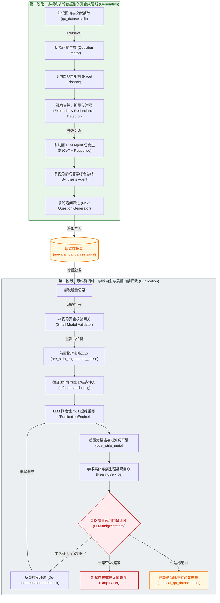
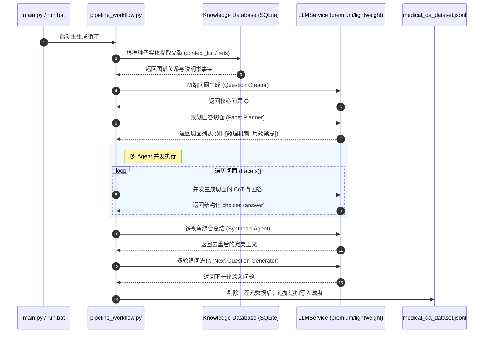
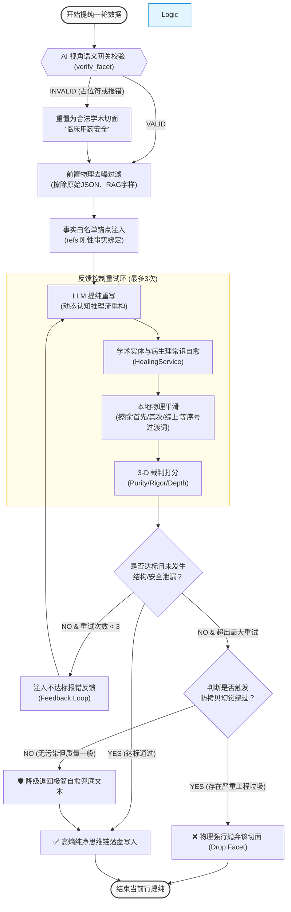

# 🩺 医疗多视角思维链（CoT）数据合成与净化项目系统架构流程图

本模块文档对本项目（`Medical QA Facet Synthesis & CoT Purification`）的双阶段核心流转架构进行深度解构，并使用 **Mermaid** 绘制了精美的系统级数据流向与控制流图，存入 `docs` 目录作为项目的官方技术规格说明。

---

## 📊 1. 系统全局双轨运行图 (Global System Architecture)

本系统采用**双轨合流设计**：**第一轨（Generation Pipeline）**负责基于知识图谱与多视角 Agent 仿真合成多轮对话数据集；**第二轨（Purification Pipeline）**负责离线大模型思维链（CoT）语义提纯、学术对齐与 3D 质量门禁校验。

---

## 🛠️ 2. 子系统流程详析 (Sub-System Deep Dive)

### 2.1 数据集仿真合成控制流 (Generation Pipeline Workflow)
第一阶段的控制流主要由 `pipeline_workflow.py` 驱动，实现了从非结构化文献图谱向结构化多视角 CoT 对话的演进：

---

### 2.2 思维链语义提纯控制流 (CoT Purification Workflow)
第二阶段的控制流由 `medicalqa_purifier.py` 驱动，是保障生成数据可直接用于顶尖推理大模型（如 DeepSeek-R1、o1 等）微调的**工业级数据质检门禁**：

---

## 💎 3. 核心质量门禁指标 (Quality Gate Metrics)

项目通过 `LLMJudgeStrategy` 对思维链重构实施三维质检标准：

| 评估维度 (Dimension) | 达标分数线 | 核心惩罚红线 (One-strike Penalty) | 优化处理机制 |
| :--- | :--- | :--- | :--- |
| **🟢 语义纯净度** | **85 / 100** | 包含 `JSON`、`Schema`、`refs` 等工程元数据；使用“首先、其次”等阶梯序号或出现“我将从以下切面回答”等元叙述。 | 一票否决降至 60 分以下，启动反馈控制环重写，若三次失败则**直接丢弃**。 |
| **🩺 医学严谨度** | **90 / 100** | 与知识图谱 `refs` 事实（受体、基因型、发生率）冲突；或无确切文献公理支撑下虚构分子骨架/特异性结合效能。 | 图谱强Fact一致性对齐，触发伪学术幻觉一票否决扣至 50 分以下。 |
| **🧠 逻辑深度** | **85 / 100** | 通篇为平淡无奇的说明书说明文，无动态摩擦词（“既然...必然...”），无探究性疑问反思（缺乏“?”疑问锚点）。 | 强制字数限制（需 > 150字），推导极简化直接惩罚扣分，通过重写激活参数化临床知识。 |

---

## 🎯 4. 数据提纯的学术理念

项目的提纯净化拒绝简单的“文本剔除”，而是为了生成最符合人类顶尖医生大脑认知的思维链。
在最终的 `medical_qa_dataset.jsonl` 中，净化后的思维链展现了经典的**五阶段动态临床推理心流**：

$$\text{核心矛盾解构} \xrightarrow{\text{因果推演}} \text{微观病生理逻辑} \xrightarrow{\text{假说排查}} \text{分叉与特殊情况} \xrightarrow{\text{核准校对}} \text{生理/安全极限} \xrightarrow{\text{自然合拢}} \text{决策得出}$$

这套高度规范的流程图已与目前最新的代码库保持 100% 同步，并作为指导本项目未来工程化、工业级数据微调准备的重要技术规范。
