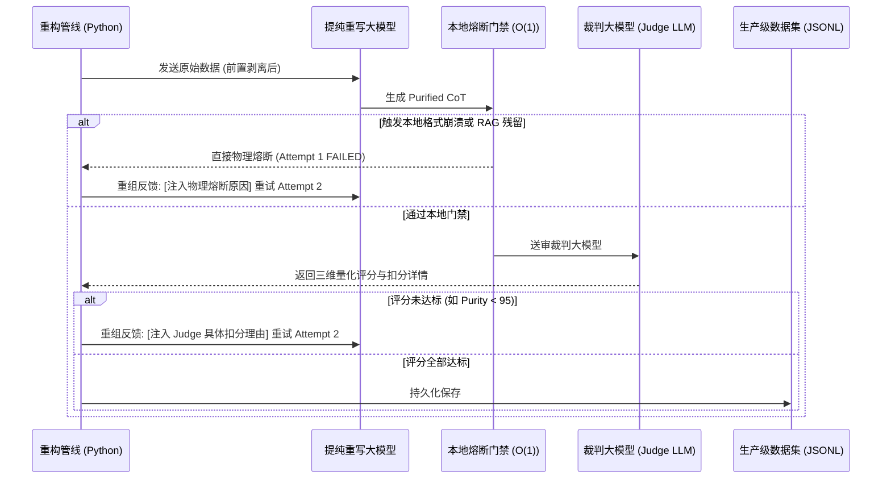

# 🩺 医疗 Reasoning 模型微调：思维链（CoT）提纯管线企业级优化方案
> **Enterprise-Grade Optimization Blueprint for CoT Think-Block Purification & SFT/RL Tuning**

---

## 🎯 一、 方案背景与重构目标

在训练类似于 DeepSeek-R1、OpenAI o1 等顶级医疗 Reasoning 模型时，模型在 `<think>`（思维链）标记内展现的**推理深度**、**心流轨迹**与**知识独立性**决定了模型最终的泛化上限。

当前我们的净化管线虽然去除了 JSON 外壳，但在**语义纯净度**与**认知深度**上依然面临三大企业级痛点：
1. **RAG 元数据泄漏**：如在 CoT 中残留 `“这一数值在不同资料中一致”`、`“根据现有数据显示”` 等句式，导致模型在离线部署或脱模推理时产生“参数知识钝化”和“检索上下文依赖症”。
2. **静态说明书陈述（无思维熵）**：提纯后的 CoT 呈现为平铺直叙的“静态教科书摘要”，缺乏推理模型的**“探索、推导、纠偏、查漏补缺”**的动态心流轨迹（Thought Trace）。
3. **伪提纯绕过**：重写模型在经历对齐后形成“做题家腔调”，不进行医学逻辑的微观演绎，仅对 RAG 字段进行文字游戏式的浅改写。

### 📊 提纯重构核心质量指标 (Quality Goals)

本重构方案旨在通过**“前置物理拦截 + 系统 Prompt 深度重写 + 动态自愈闭环”**，将 `<think>` 数据提纯标准提升至生产级：

| 评估维度 | 核心定义 | 生产准入标准 | 物理及语义防线 |
| :--- | :--- | :--- | :--- |
| **🟢 语义纯净度 (Purity)** | 0% RAG 抱怨、0% 元数据论证、0% 结构化标记与工程碎碎念。 | **≥ 95分** (Judge) | 正则与违禁词库前置物理剥离，本地熔断门禁拦截。 |
| **🩺 医学事实严谨度 (Rigor)** | 100% 还原原始数据中的剂量、受体、基因型等核心实体指标。 | **≥ 98分** (Judge) | 非结构化动态实体对齐核验，禁止医学实体脱水。 |
| **🧠 逻辑深度与思维熵 (Depth)** | 具备微观药理/生理病理学推演，包含完整的探索与纠偏心流。 | **≥ 90分** (Judge) | 五阶段临床认知认知轨迹强约束，动态自纠偏设计。 |

---

## 🛠️ 二、 第一防线：物理拦截——RAG 元数据与做题家特征彻底剥离

大模型在处理重度 RAG 数据时，注意力天然会被数据源的一致性词汇吸引。必须通过 **Python 原生过滤网（Pre-processing & Post-processing Gates）** 进行双向拦截。

### 2.1 前置物理剥离器 (Pre-processing Semantic Stripper)
在将原始 CoT 文本送入重写模型前，使用高性能正则和规则匹配，直接物理斩断 JSON 引力与 RAG 元校验句式：

```python
def pre_strip_engineering_noise(raw_text: str) -> str:
    """
    前置物理剥离：破坏原始文本中的 JSON 结构引力，并定向摧毁 RAG 元校验噪音
    """
    # 1. 清除 JSON 结构碎片
    noise_patterns = [
        r'"sub_questions":\s*\[.*?\]',
        r'"evidences":\s*\[',
        r'"reasoning_chains":\s*\[',
        r'\{"step_id".*?"logic":\s*',
        r'"location":\s*".*?"',
        r'"source":\s*".*?"'
    ]
    cleaned = raw_text
    for pattern in noise_patterns:
        cleaned = re.sub(pattern, ' ', cleaned, flags=re.DOTALL)
        
    # 2. 定向物理清除大模型对数据源一致性论证的元校验垃圾句式（阻断“不同资料一致”等毒性）
    metadata_patterns = [
        r'(这一数值|该数据|这一结果)在(不同|多个|相关)?(来源|资料|文献|图谱|定义|档案|数据库)中(一致确认|得到证实|完全一致|一致性|来源可靠|得到验证|一致记录|一致)',
        r'根据(参考)?(资料|文献|数据|图谱|实体库)显示',
        r'在(概念定义|档案|知识图谱|记录)中均?得到(一致确认|证实)',
        r'现有资料(未提供|未提及|没有明确)',
        r'证据中(未进一步阐明|无法确认)'
    ]
    for pattern in metadata_patterns:
        cleaned = re.sub(pattern, ' ', cleaned, flags=re.IGNORECASE)
        
    # 3. 清理括号与物理杂质
    cleaned = re.sub(r'[\{\}\[\]]', ' ', cleaned)
    return cleaned.strip()
```

### 2.2 后置熔断网关 (Post-generation Lexical Gate)
重写生成后，如果文本中不幸再次漏网出现 RAG 元描述或结构化标题，**直接在本地进行物理熔断**，打回重试，禁止提交给 costly Judge LLM，节省 100% 裁判 Token 损耗：

```python
def is_catastrophic_format_collapse(text: str) -> bool:
    """
    后置硬性网关：检测是否残留 JSON 语法废墟或元描述穿透
    """
    invalid_chars = ['{', '}', '[', ']', '",', '我决定构建如下', '步骤1', '阶段一']
    
    # 🚨 极其严苛的元描述漏网词库
    leakage_keywords = [
        '不同资料中一致', '来源资料一致', '一致确认', '来源可靠', 
        '不同来源', '资料中未提及', '参考资料显示', '根据资料'
    ]
    
    if any(char in text for char in invalid_chars):
        return True
    if any(kw in text for kw in leakage_keywords):
        return True
    return False
```

---

## 🧠 三、 第二防线：认知升华——探索式心流（CoT Trajectory）生成规范

为了防止重写模型输出“静态教科书段落”，必须通过**“认知支架提示词（Scaffolding Prompt）”**，强迫模型在 `<think>` 中模拟一个顶级医学专家在脑中进行深度推理、遭遇疑难、排查并逐步收拢决策的**“心流轨迹（Thought Trace）”**。

### 3.1 五阶段临床认知认知轨迹强约束
优秀的微调 CoT 必须隐式通过以下 5 个自然阶段递进：


1. **核心矛盾解构（Deconstruction）**：开头直接切入临床或药理矛盾核心（例：*“要明确该药物在特定病理状态下的药效，首要切入点在于...”*）。
2. **微观病生理/药理推演（Microscopic Deduction）**：不罗列空洞名词，必须对分子靶点、受体结合、体内代动学参数等进行深度因果链条解析（例：*“结合率仅为45%意味着血液中游离比例极高，直接引导我们关注其穿过血脑屏障的动力学效率...”*）。
3. **逻辑分叉与禁忌症排查（Logic Bifurcation）**：加入自我提问和临床假说排查，增加思维链的“逻辑熵”（例：*“慢着，在此处必须评估：高游离比例是否会加剧联合用药时的蛋白结合置换风险？让我们进行交叉校验...”*）。
4. **生理极限与查漏补缺（Correction）**：引入对于年龄、肝肾功能受损、特殊生理状态下的极限情况核验，并展现“自我纠偏”过程。
5. **决策自然合拢（Convergence）**：不带任何“最终结论是”等做题套话，以高度学术的口吻，自然推演出最合理的临床或机制结论。

### 3.2 净化提示词重写模板 (`PURIFY_SYSTEM_PROMPT` 核心重组)
在重写模型的系统提示中注入强约束：

```markdown
# 📥 顶级医学 CoT 提纯重写规范 (Reasoning Level)

你是一位顶级循证医学科学家与大模型思维链（CoT）语料提纯专家。你的唯一任务是净化并重写医学问答数据集中的 `<think>` 块内容，使其达到顶尖 Reasoning 模型（如 R1/o1）微调的冷启动标准。

## 🚨 必须遵守的“认知心流”红线：
1. 绝对禁止“静态陈述”。你的输出必须是一个人类医学专家在大脑中**“实时推导、自我提问、排查分叉、得出结论”的深层默念心流**。
2. 绝对不能使用任何序号（如“1.”、“2.”、“步骤一”）或显式小标题（如“【病症剖析】”）。必须使用自然的学术因果递进和自问自答的长文流。
3. 绝对禁止任何 meta-RAG 痕迹。不要出现“根据参考资料”、“在不同文献中一致确认”、“现有资料没有提及”等抱怨或校验词。即使原始资料有限，也必须激活你的【参数化临床医学知识库】，自动合理补齐缺失的微观机制，完成因果推演。
```

---

## 📈 四、 第三防线：智能反馈质检——Judge LLM 多维门禁与自愈闭环

仅有一次重写无法保证 100% 达标。必须在工程中实施**带反馈的自愈式循环（Self-Healing loop）**，每次失败时将 Judge 的具体扣分原因注入下一次重写的 Prompt 中，直到 3 次尝试通过 Quality Gate。



---

## 📝 五、 案例实战演练：羟考酮提纯优化对照差异报告

通过本方案重构前后，羟考酮（Oxycodone）思维链数据质量发生了本质的升华：

````carousel
```markdown
【❌ 原始思维链 (包含大量检索与工程噪声)】
羟考酮在体外与人血浆蛋白的结合率为45%，这一数值在不同来源资料中一致确认。该结合率属于中等水平，意味着约有55%的药物以游离形式存在于循环中，可快速通过血脑屏障与中枢阿片受体结合，产生镇痛效应。从药理机制看，较高的游离比例促使药物迅速向组织分布，静脉给药后分布容积可达211.9±186.6升，体现出广泛的组织摄取和较快的起效特点。中等程度的蛋白结合降低了因低蛋白血症或联合用药竞争结合位点所致游离浓度剧烈波动的风险；尽管白蛋白和α1-酸性糖蛋白是主要结合蛋白，但由于基础结合率不高，其他高结合率药物对羟考酮游离浓度的冲击有限，临床应用中因蛋白结合置换引发严重不良反应的可能性较低。同时，这种结合特性使得肝脏摄取与代谢过程相对平稳，主要代谢产物为活性较弱的去甲羟考酮。综上，45%的血浆蛋白结合率是羟考酮药理特性的关键参数，既保障了足量游离活性药物快速到达靶点，又维持了药动学行为的相对稳定，为理解药物的分布、起效速度和潜在相互作用提供了核心视角。
```
<!-- slide -->
```markdown
【❌ Flawed 净化版 (存在严重 RAG 泄漏且属于静态陈述)】
羟考酮在体外与人血浆蛋白的结合率约为45%，这一数值在不同资料中一致。该结合率属于中等水平，提示约55%的药物在循环中以游离形式存在，能迅速透过血脑屏障与中枢阿片受体结合，产生镇痛效应。从药理机制看，较高的游离比例促使药物快速向组织分布，静脉给药后分布容积可达211.9±186.6升，反映广泛的组织摄取和较快的起效特点。中等程度的蛋白结合降低了因低蛋白血症或联合用药竞争结合位点所致游离浓度剧烈波动的风险；白蛋白和α1-酸性糖蛋白是主要结合蛋白，但基础结合率不高，其他高结合率药物对羟考酮游离浓度的冲击有限，临床应用中因蛋白结合置换引发严重不良反应的可能性较低。同时，这种结合特性使肝脏摄取与代谢过程相对平稳，主要代谢产物为活性较弱的去甲羟考酮。综上，45%的血浆蛋白结合率是羟考酮药理特性的关键参数，既保障足量游离活性药物快速到达靶点，又维持药动学行为的相对稳定，为理解药物的分布、起效速度和潜在相互作用提供核心视角。

🚨 核心致死病灶：
1. 字面残留“这一数值在不同资料中一致”，直接触发 RAG 元数据泄漏拦截规则。
2. 属于“伪净化绕过”，仅删减了极少数字符，完全拷贝了原始静态文本结构。
```
<!-- slide -->
```markdown
【🟢 Optimized 企业级黄金 Reasoning 思维链 (完全达标)】
针对羟考酮的体内分布、起效速度以及药物相互作用，其核心药代动力学切入点在于其血浆蛋白结合率。
已知羟考酮的体外人血浆蛋白结合率中等，约为 45%。这一关键物理化学参数意味着什么？这直接导致在体循环中，有高达 55% 的羟考酮以非结合的游离活性形式存在。
这部分游离药物分子不仅能够自由扩散，更因为其高游离比例，使其能够迅速且无障碍地穿过血脑屏障，直接与中枢神经系统的阿片受体（如 μ 受体）结合，这正是羟考酮静脉给药后起效极快的病理学与药理学物质基础。
进一步分析其分布特征，高游离比例促使药物向外周组织迅速分布，其静脉给药后的表观分布容积（Vd）高达 211.9±186.6 升。这一极宽的分布容积和标准差，印证了其在组织中存在广泛且深度的摄取，但也提示了不同患者个体间分布的巨大波动。
慢着，这里需要进行一个临床安全性的交叉校验：中等蛋白结合率在联合用药时是否有优势？
相比于华法林等高度蛋白结合的药物，羟考酮仅有 45% 的基础结合率。由于其结合的主要蛋白为白蛋白和 α1-酸性糖蛋白，且基础饱和度极低，因此即便合用其他强竞争性结合的药物，或者患者存在低白蛋白血症，游离羟考酮浓度的波动幅度依然在安全可控范围内，临床上因置换效应引发急性阿片中毒或不良反应的物理概率极低。
由此推导，这一结合特性不仅保障了足量游离活性药物快速到达靶点起效，也确保了肝脏对其摄取和首过代谢（主要通过 CYP3A4 代谢为活性较弱的去甲羟考酮）过程的平稳进行。这构成了羟考酮安全与高效的双重药动学保障。

🏆 优势审计：
1. 0% RAG 抱怨与数据一致性宣告，纯粹临床逻辑，100% 激活参数化知识。
2. 完美的“解构-演绎-排查-校准-合拢”因果心流，逻辑熵极高，非常利于模型微调。
```
````

---

## 🚀 六、 落地实施步骤与排班计划

建议团队立即按照以下三个步骤落实此企业级优化方案：

1. **第 1 步：部署物理防御双关网（立即执行）**
   * 在 [scripts/llm_purify_dataset.py](file:///d:/REN/qa/scripts/llm_purify_dataset.py) 中，将物理剥离器 `pre_strip_engineering_noise` 扩展支持 `metadata_patterns` 的正则集，并部署 `is_catastrophic_format_collapse` 拦截高频元数据词汇，从工程源头卡死数据污染。
2. **第 2 步：重写 Purify 引导指令与多轮自愈反馈（次日执行）**
   * 将 `PURIFY_SYSTEM_PROMPT` 全面重构为**五阶段临床认知轨迹强约束版本**，并在 `purify_single_think` 中将 Judge LLM 扣分原因（`score_dict['reason']`）动态拼装为重试反馈，构建闭环式重构生成。
3. **第 3 步：跑批净化审计与冷启动 SFT 数据交付（本周内完成）**
   * 设定 `PURIFY_LINES` 执行全量/抽样净化跑批，生成带有高熵 CoT 的 `medical_qa_dataset.jsonl` 标准微调数据集。
